# PF / TVT / OOF 診断集約 2026-06-24

## 目的

PF/Beam 生成候補の coverage、TVT 解説画像、MD / tail 距離別 TVT RMSE、OOF 誤差分析を、人間が読むための Markdown と代表画像に集約する。

この集約配下には CSV / ZIP は置かない。数値は元成果物から読み取って本文に転記し、画像は代表的な PNG だけを `pf_tvt_oof_readout_20260624_assets/` に置く。

## 参照元

- PF 候補 coverage: `experiments/exp093_pf_candidate_coverage_then_ranker_audit/result.md`
- PF/Beam vs true TVT 可視化: `experiments/exp083_pf_beam_true_tvt_2d_well_eda/result.md`
- exp073 OOF 距離別 RMSE: `experiments/exp073_gpu_reproducibility_guard_for_exp063_full_replay/SESSION_NOTES.md`
- OOF feature / error readout: `experiments/exp086_oof_feature_importance_error_readout/result.md`
- 特徴量重要度順の説明: `docs/analysis/feature_importance_explained_20260624.md`
- TVT 概念図: `docs/images/`

## 結論

PF/Beam 候補集合には明確な oracle headroom がある。baseline 5候補の oracle は RMSE 7.434 / within10 0.9065、self-GR 追加後の oracle は RMSE 6.959 / within10 0.9225 まで届く。一方で現行 target-free rank score top1 は baseline でも RMSE 12.508、self-GR 追加では RMSE 29.986 に悪化する。候補を増やすより、候補を正しく選ぶ scorer / likelihood / verifier が主課題。

PF ANCC は oracle best になる行が 1,092,069 rows、全体の 28.86% あるが、現行 rank score top1 では 0 rows。現行 scorer は PF ANCC を過小評価している。`likpf_mean` は単体 RMSE 11.595 で最良 single candidate だが、oracle との gap が大きい。

exp083 の per-well 可視化では、well 平均 RMSE は PF 10.845、Beam 12.587、anchor 12.812。PF は Beam に 478/773 wells で勝ち、anchor に 474/773 wells で勝つ。ただし Beam が PF に勝つ well も 295、anchor が PF に勝つ well も 299 あり、worst PF well では PF RMSE 68.801 まで壊れる。直接 PF 置換は危険。

exp073 OOF の RMSE は tail で急激に悪化する。`last_known_tvt` からの TVT 絶対距離が 20-40 ft で RMSE 13.027、40-60 ft で 26.924、80 ft 以上で 59.191。row step でも 1501+ bucket が全行の 69.4% だが MSE の 90.1% を占める。

exp086 の OOF readout では `longtail_likpf_tiny_gate_w006` が baseline exp073 `lgb_mean` を RMSE 9.526375 から 9.470515 へ -0.055860 改善した。誤差が大きい bucket は PF/dense surface disagreement と dense TVT delta に強く結びつく。これは direct replacement ではなく、confidence / sample weight / clipped gate の材料として使うべき。

2026-06-24 の追加 by-well readout では、PF/Beam と ML OOF の両方で「当たる well / 外れる well」を分ける主因は GR 欠損率ではなく、評価 tail の TVT 変動量だった。`tvt_span_eval`、`tvt_std_eval`、`last_known_tvt` からの絶対 drift、PF と dense surface の不一致が大きい well ほど外れやすい。外れ well では `tvt_dense` が oracle 候補になる比率が高く、`likpf_mean` 直接採用ではなく dense 候補を低頻度で選ぶ confidence gate の余地がある。

## 2026-07-16 selector更新

後続のexp237 OOFとexp243/252により、BeamとPF seed平均の位置づけを更新した。詳細は[exp238 selector / TVT feature audit](../surveys/exp238_selector_tvt_feature_audit_20260716.md)を正とする。

- `beam_mean`は単体RMSE 15.774で直線的なpathが多いが、exp237 oracleでは316,191行（8.36%）で最良だった。row-wise selectorがBeamを選んだ79,508行ではBeam RMSE 11.454、同じ行のlikPFは15.803で、BeamをlikPFへ強制置換すると全体RMSEは8.54523から8.68974へ+0.14452悪化する。したがって削除せず1本だけreserveに残し、Beam variantは増やさない。
- 一方、selectorのoracle-Beam recallはrow-wise 4.43%、Viterbi 3.95%に留まる。Beamが勝つ領域の識別が課題であり、見た目の直線性をhard gateにはしない。exp173/177のBeam top-K posterior、cost-gap/entropy gateはnegativeなのでclosedのままとする。
- `likpf_mean`はseedの単純算術平均ではなくlikelihood-weighted mean。exp243 K8 medoidは平均前の実在seed trajectoryを保持し、base8 + K8 oracleをrow 4.5646→3.2162、whole-well 6.5924→5.4996へ改善した。direct medoidは12.2967でlikPF 11.5949より弱いため、直接置換せずbase8 fallback付きselector候補とする。
- exp252ではK8内のcluster likelihood mass / rank / gapにwhole-well AUC 0.6752 / 0.6551 / 0.6542の信号があった。ただしK8 bank gateは最良0.5606、固定top1はbest base8比+3.1949 ftで、候補信頼度を組み合わせる必要がある。
- HMM posterior TVT stdはすでにexp237 selectorへ入力済みで、`hmm_exact_std`はsplit importance 9位。exp205のabsolute error相関は0.3995だが、exp221/223でlow-std過信があるため、σ単独のhard gateではなくouter-fold内で候補誤差へ校正する。

## TVT 概念図

### TVT と typewell

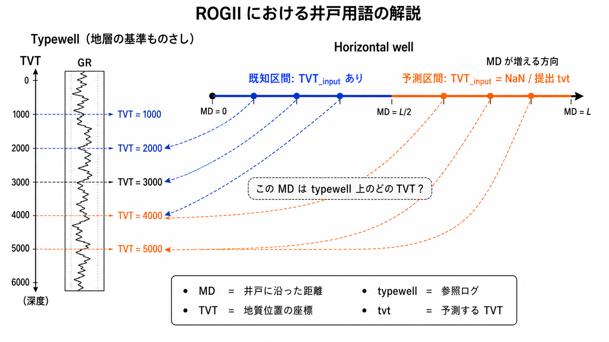

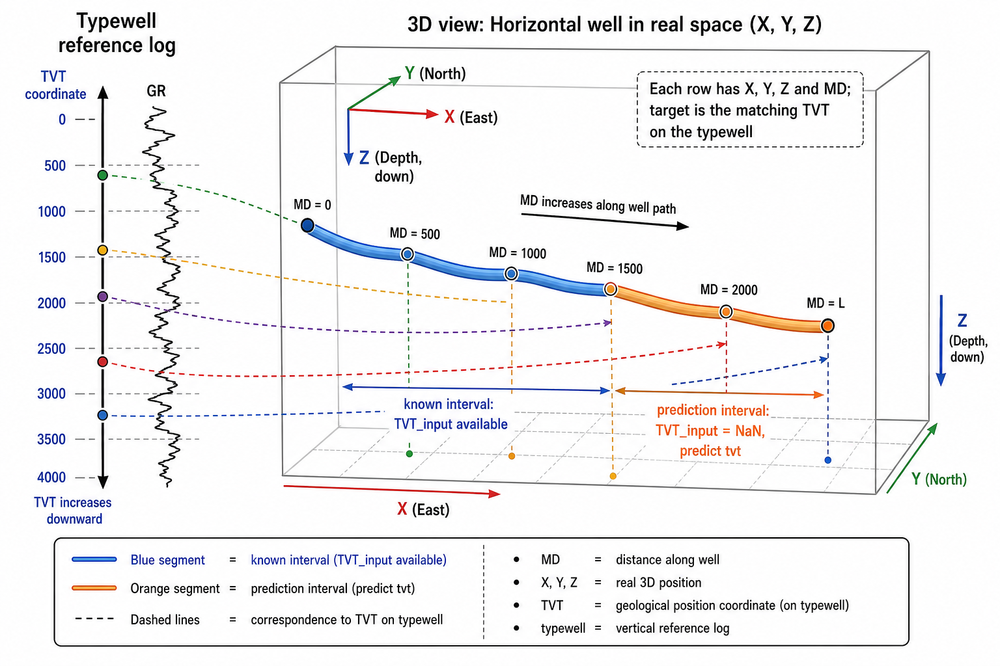

### Z と TVT の関係

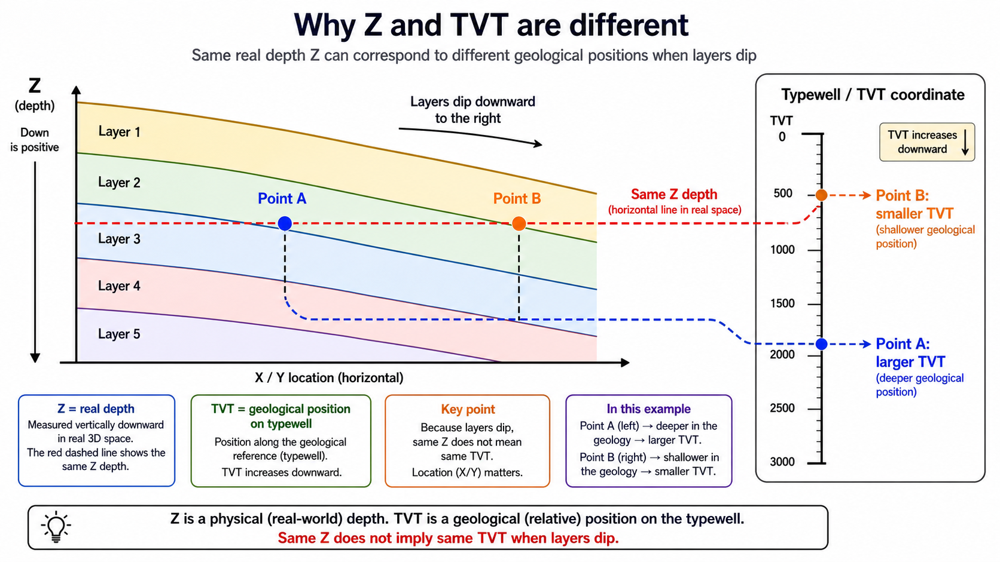

### ANCC reference surface

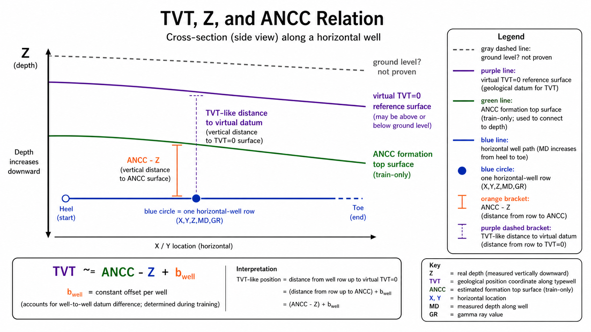

## PF 候補 Coverage

exp093 は exp072 full replay cache 3,783,989 rows / 773 wells を使った train-side audit。候補集合が真値近傍を含むか、target-free rank score がそれを選べるかを分けて見ている。

### Single candidate

| candidate | RMSE | MAE | within10 | 解釈 |
| --- | ---: | ---: | ---: | --- |
| `likpf_mean` | 11.595 | 7.068 | 0.7728 | single candidate 最良 |
| `pf_ancc` | 14.493 | 8.922 | 0.6917 | 単体は弱いが oracle contribution が大きい |
| `beam_mean` | 15.774 | 10.899 | 0.5916 | PF より単体悪化 |
| `last_anchor_tvt` | 15.910 | 11.196 | 0.5786 | near-prefix では効くが全体では弱い |
| `hyb` | 117.249 | 83.427 | 0.1671 | 直接候補としては不安定 |

### Candidate set oracle と rank score

| candidate set | selector | RMSE | MAE | within10 | self-GR 選択率 |
| --- | --- | ---: | ---: | ---: | ---: |
| baseline primary | oracle best | 7.434 | 3.745 | 0.9065 | 0.0000 |
| baseline primary | rank score top1 | 12.508 | 7.627 | 0.7488 | 0.0000 |
| baseline + self-GR | oracle best | 6.959 | 3.336 | 0.9225 | 0.1558 |
| baseline + self-GR | rank score top1 | 29.986 | 8.919 | 0.7468 | 0.0048 |

解釈:

- Oracle では候補集合に十分な headroom がある。
- 現行 rank score top1 は oracle headroom を拾えていない。
- self-GR は oracle では効くが、現行 score に混ぜると top1 が壊れる。

### Oracle best / rank score top1 の候補別選択回数

| candidate | oracle best count | oracle best rate | rank score top1 count | rank score top1 rate |
| --- | ---: | ---: | ---: | ---: |
| `likpf_mean` | 1,242,769 | 0.3284 | 2,729,282 | 0.7213 |
| `pf_ancc` | 1,092,069 | 0.2886 | 0 | 0.0000 |
| `beam_mean` | 443,268 | 0.1171 | 1,036,513 | 0.2739 |
| `last_anchor_tvt` | 370,631 | 0.0979 | 0 | 0.0000 |
| `self_gr_sc25` | 175,030 | 0.0463 | 0 | 0.0000 |
| `self_gr_best` | 167,674 | 0.0443 | 0 | 0.0000 |
| `self_gr_sc15` | 141,924 | 0.0375 | 0 | 0.0000 |

最重要な異常は `pf_ancc`。Oracle best では 28.86% の行で最良だが、rank score top1 では一度も選ばれない。PF ANCC を上位化できない scorer のまま supervised ranker に進むと、学習対象の構造を誤る可能性が高い。

### Distance bucket

| candidate set | selector | bucket | rows | RMSE | within10 |
| --- | --- | --- | ---: | ---: | ---: |
| baseline primary | oracle | 000-050 | 38,650 | 0.318 | 1.0000 |
| baseline primary | rank top1 | 000-050 | 38,650 | 0.691 | 1.0000 |
| baseline primary | oracle | 250-500 | 193,157 | 2.680 | 0.9880 |
| baseline primary | rank top1 | 250-500 | 193,157 | 4.606 | 0.9515 |
| baseline primary | oracle | 500-1000 | 385,911 | 4.197 | 0.9595 |
| baseline primary | rank top1 | 500-1000 | 385,911 | 7.182 | 0.8698 |
| baseline primary | oracle | 1000+ | 3,011,671 | 8.162 | 0.8886 |
| baseline primary | rank top1 | 1000+ | 3,011,671 | 13.722 | 0.7045 |
| baseline + self-GR | oracle | 1000+ | 3,011,671 | 7.644 | 0.9077 |
| baseline + self-GR | rank top1 | 1000+ | 3,011,671 | 31.610 | 0.7023 |

Tail bucket でも oracle coverage は残っている。問題は候補生成だけではなく、tail で ranker / scorer が候補を誤選択すること。

## PF/Beam vs true TVT 可視化

exp083 は exp072 cache の PF/Beam/likelihood-PF 候補を true TVT と well ごとに重ねた visual EDA。現在の参照は v11 の全 773 wells diagnostic plot で、clean plot に `PF Z`、全 formation band、`Z` 背景、下段 `dZ/dMD` を追加している。この集約には代表例だけ置く。

参照元:

- v11 manifest: `experiments/exp083_pf_beam_true_tvt_2d_well_eda/artifacts/pf_beam_true_tvt_2d_well_eda_clean_all_pfz_formation_bands_z_dzdmd_plot_manifest.csv`
- v11 plot dir: `experiments/exp083_pf_beam_true_tvt_2d_well_eda/artifacts/pf_beam_true_tvt_2d_well_eda_clean_all_pfz_formation_bands_z_dzdmd_plots/`

### Aggregate

| 指標 | 値 |
| --- | ---: |
| rows | 3,783,989 |
| wells | 773 |
| mean well RMSE: PF | 10.845 |
| mean well RMSE: Beam | 12.587 |
| mean well RMSE: anchor | 12.812 |
| mean well RMSE: likelihood-PF | 8.669 |
| PF beats Beam | 478 wells |
| Beam beats PF | 295 wells |
| PF beats anchor | 474 wells |
| Anchor beats PF | 299 wells |

### Representative wells

PF が非常によく当たる例。

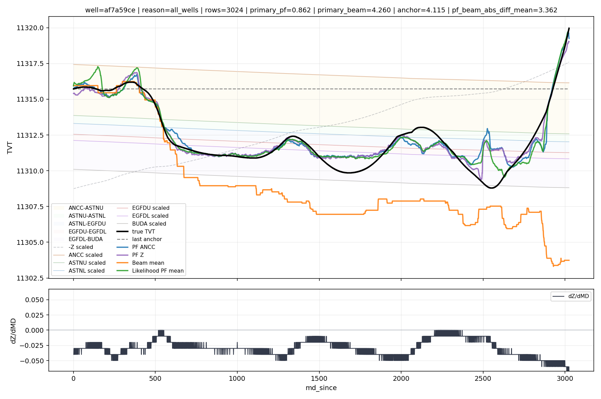

PF が大きく外れる例。

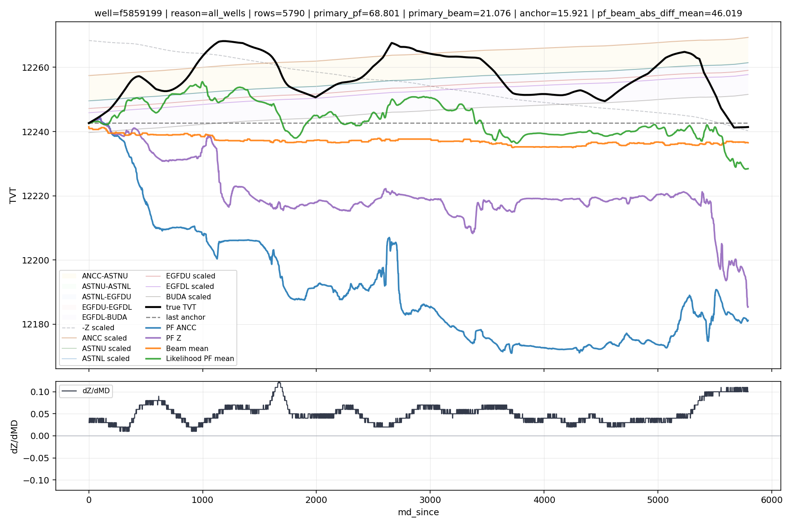

Beam が PF に勝つ例。

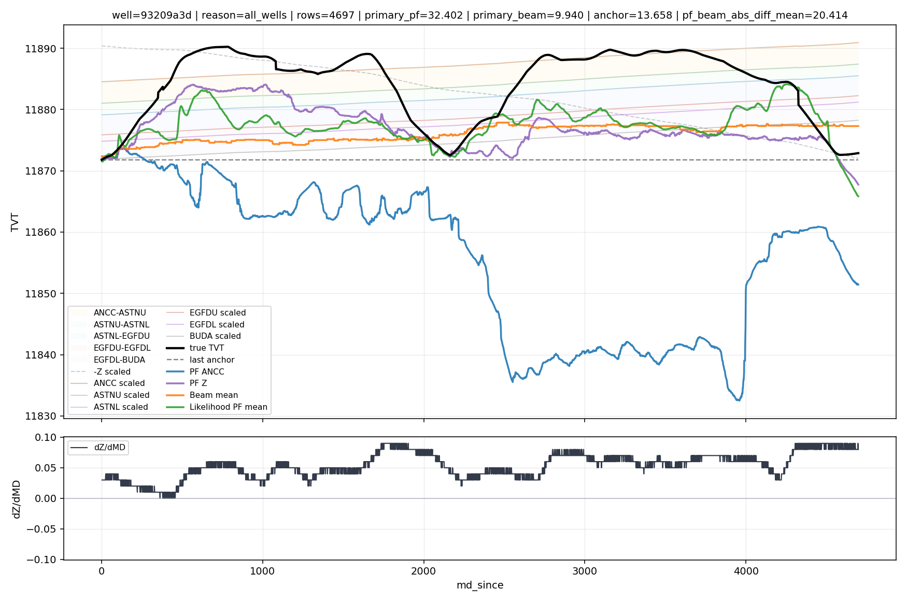

PF/Beam disagreement が大きい例。

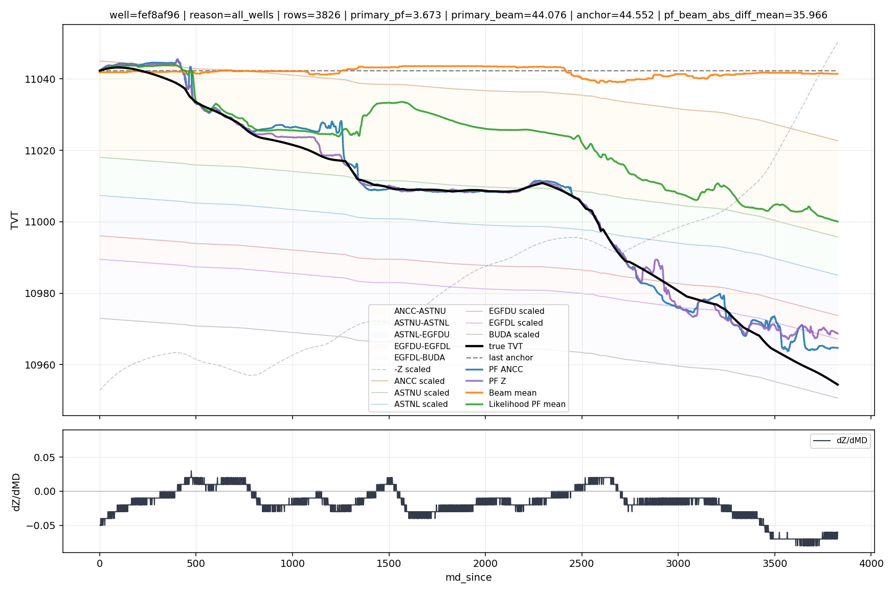

Long tail 例。

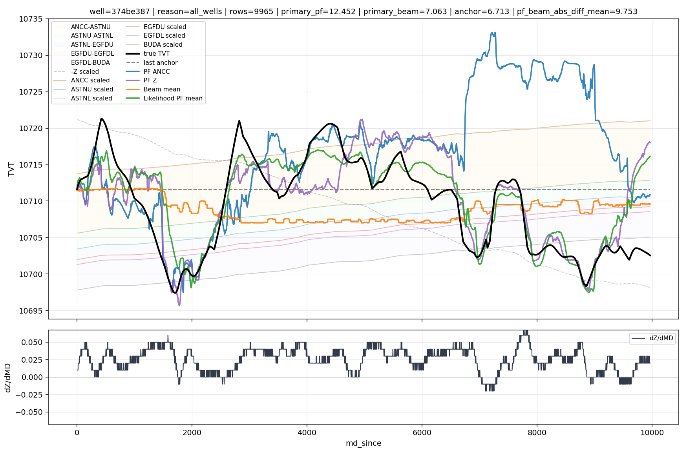

### Worst / best PF examples

| well | rows | PF RMSE | Beam RMSE | anchor RMSE | PF/Beam abs diff mean |
| --- | ---: | ---: | ---: | ---: | ---: |
| `f5859199` | 5,790 | 68.801 | 21.076 | 15.921 | 46.019 |
| `1b1eba53` | 4,655 | 59.188 | 74.147 | 70.639 | 14.089 |
| `86454a6f` | 7,964 | 55.523 | 72.779 | 70.263 | 17.369 |
| `bb337fa0` | 6,873 | 53.750 | 20.409 | 24.084 | 30.948 |
| `708caea9` | 6,548 | 47.195 | 34.075 | 34.917 | 12.525 |

| well | rows | PF RMSE | Beam RMSE | anchor RMSE | PF/Beam abs diff mean |
| --- | ---: | ---: | ---: | ---: | ---: |
| `ed6436d6` | 2,945 | 0.607 | 1.350 | 1.617 | 0.984 |
| `1a518997` | 4,606 | 0.715 | 9.064 | 10.761 | 9.248 |
| `5fb1c15f` | 2,860 | 0.805 | 19.771 | 18.291 | 18.312 |
| `af7a59ce` | 3,024 | 0.862 | 4.260 | 4.115 | 3.362 |
| `42c538a1` | 3,279 | 0.901 | 20.783 | 26.189 | 18.401 |

判断:

- PF は well 単位で強いケースが多いが、壊れる well の被害が大きい。
- PF/Beam disagreement は重要な不確実性 signal。
- PF 直接置換ではなく、confidence gate、clip、sample weighting、候補 verifier の材料にする。

## MD / Tail 距離別 TVT RMSE

exp073 train_v2 OOF `lgb_mean` の距離別 readout。

### last_known_tvt からの TVT 絶対距離

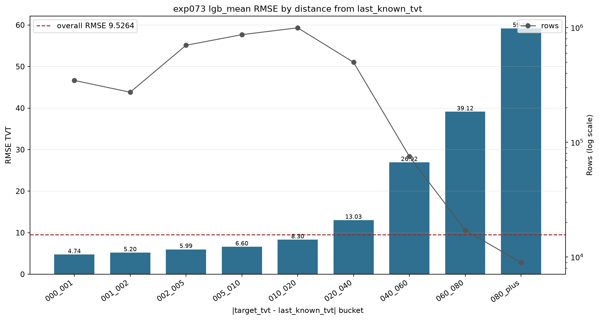

| abs TVT distance bucket | rows | wells | RMSE | MAE | error mean |
| --- | ---: | ---: | ---: | ---: | ---: |
| 000-001 | 346,194 | 773 | 4.742 | 3.021 | 0.721 |
| 001-002 | 273,201 | 773 | 5.203 | 3.450 | 0.755 |
| 002-005 | 701,213 | 773 | 5.990 | 4.149 | 0.902 |
| 005-010 | 867,736 | 768 | 6.596 | 4.823 | 0.565 |
| 010-020 | 995,739 | 706 | 8.301 | 6.278 | -0.043 |
| 020-040 | 498,539 | 407 | 13.027 | 10.190 | -1.458 |
| 040-060 | 75,325 | 80 | 26.924 | 23.408 | -2.558 |
| 060-080 | 17,102 | 20 | 39.119 | 36.200 | -17.510 |
| 080+ | 8,940 | 10 | 59.191 | 57.318 | -40.307 |

### row step / tail length

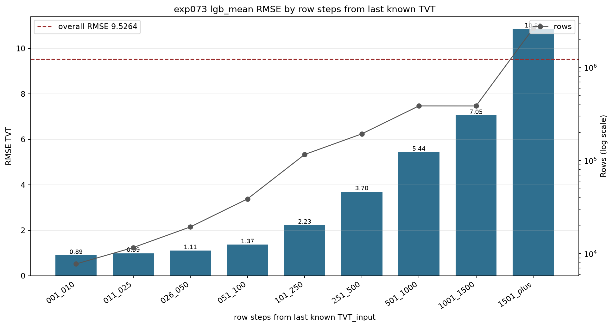

| step bucket | rows | row share | RMSE | MAE | MSE share |
| --- | ---: | ---: | ---: | ---: | ---: |
| 001-010 | 7,730 | 0.20% | 0.894 | 0.610 | 0.00% |
| 011-025 | 11,595 | 0.31% | 0.988 | 0.664 | 0.00% |
| 026-050 | 19,325 | 0.51% | 1.105 | 0.772 | 0.01% |
| 051-100 | 38,650 | 1.02% | 1.366 | 0.997 | 0.02% |
| 101-250 | 115,950 | 3.06% | 2.227 | 1.570 | 0.17% |
| 251-500 | 193,157 | 5.10% | 3.698 | 2.604 | 0.77% |
| 501-1000 | 385,911 | 10.20% | 5.438 | 3.809 | 3.32% |
| 1001-1500 | 385,500 | 10.19% | 7.053 | 4.877 | 5.58% |
| 1501+ | 2,626,171 | 69.40% | 10.856 | 7.314 | 90.12% |

判断:

- Global RMSE の大半は long tail が支配している。
- near-prefix 改善より、1501+ step と abs TVT distance 20+ ft の error control が重要。
- ただし tail だけに寄せると near-prefix を壊すリスクがあるため、distance-aware gate / fade-in / clipped correction が必要。

## OOF Feature / Error Readout

exp086 は exp073 baseline OOF と `longtail_likpf_tiny_gate_w006` を比較した診断。推論提出用ではなく、誤差構造の読み出し。

### Policy metrics

| policy | RMSE | MAE | error mean | delta vs baseline |
| --- | ---: | ---: | ---: | ---: |
| `baseline_exp073_lgb_mean` | 9.526375 | 6.159766 | -0.011619 | 0.000000 |
| `longtail_likpf_tiny_gate_w006` | 9.470515 | 6.110920 | -0.076884 | -0.055860 |

### Error lift

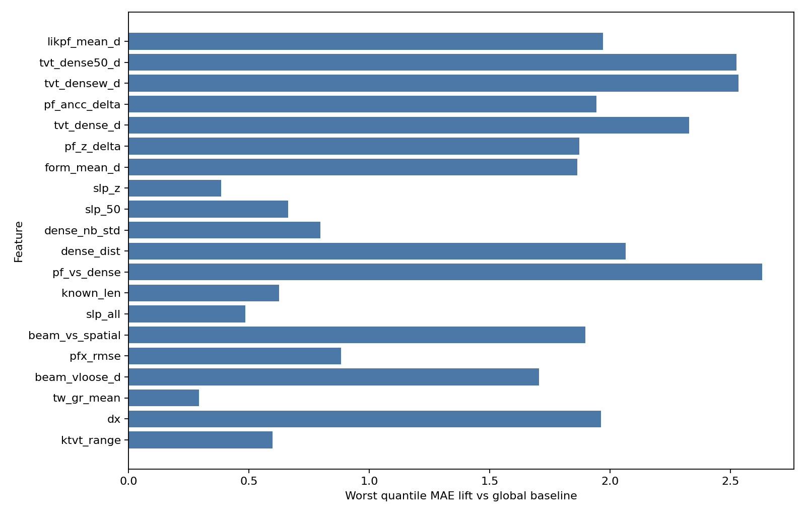

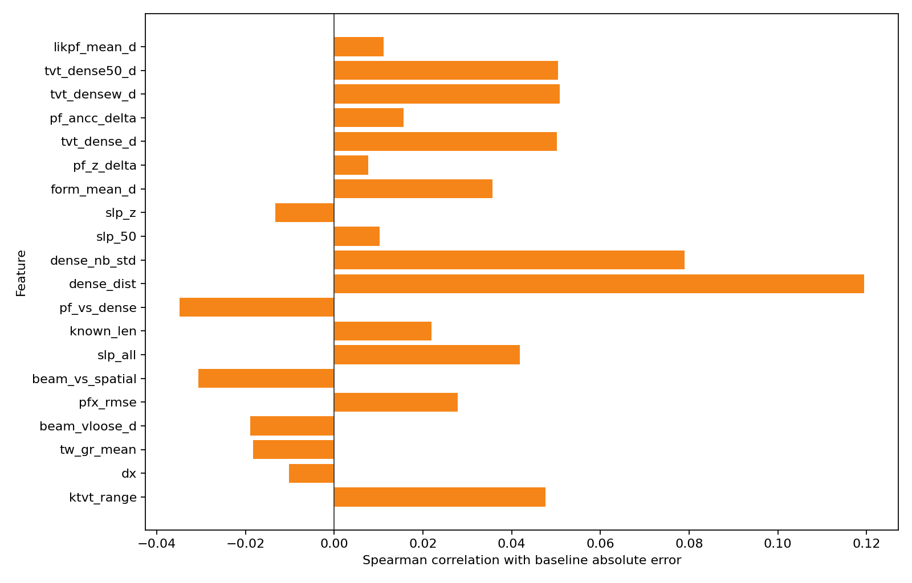

### High-error buckets

| feature | worst bucket | baseline RMSE | baseline MAE | MAE lift vs global | compare RMSE delta |
| --- | --- | ---: | ---: | ---: | ---: |
| `pf_vs_dense` | large negative disagreement | 12.784 | 8.792 | +2.632 | -0.072 |
| `tvt_densew_d` | large positive dense delta | 12.852 | 8.694 | +2.534 | -0.059 |
| `tvt_dense50_d` | large positive dense50 delta | 12.812 | 8.684 | +2.524 | -0.053 |
| `tvt_dense_d` | large positive dense delta | 12.687 | 8.488 | +2.329 | -0.063 |
| `dense_dist` | high dense distance | 12.830 | 8.225 | +2.065 | -0.129 |
| `likpf_mean_d` | large positive likPF delta | 12.112 | 8.130 | +1.970 | -0.117 |

判断:

- 誤差が大きい領域は PF / dense / Beam / likelihood 系の disagreement でかなり説明できる。
- `beam_std_d` は選択特徴の中で Spearman absolute-error correlation が強い。
- `dense_dist` も absolute error との相関が比較的強い。
- これらは予測値をそのまま置換する候補ではなく、confidence、uncertainty、sample weight、clip strength の入力にする。

## 当たる well / 外れる well の特徴

2026-06-24 の追加調査では、既存成果物の per-well summary を使い、raw train horizontal well から集計した統計量を join した。現在の参照パスは v11 manifest。対象は 773 wells。`TVT_input` が欠損している評価 tail だけを使って、TVT range、TVT std、last known TVT からの drift、Z span、GR 欠損、PF/dense disagreement などを比較した。

参照元:

- PF/Beam manifest: `experiments/exp083_pf_beam_true_tvt_2d_well_eda/artifacts/pf_beam_true_tvt_2d_well_eda_clean_all_pfz_formation_bands_z_dzdmd_plot_manifest.csv`
- ML OOF well summary: `/tmp/kaggle-output/exp086_oof_feature_importance_error_readout/train_v1/artifacts/exp086_oof_feature_importance_error_readout_well_summary.csv`
- raw train well files: `data/raw/train/*__horizontal_well.csv`

### PF/Beam: `likpf_mean` best50 vs worst50

`likpf_mean` が当たる well は oracle 候補との差が小さく、tail の TVT 変動も小さい。外れる well は `likpf_mean` 自体は大きく外れるが、候補集合内に `tvt_dense` や `pf_z` などの助かる候補が残るケースが多い。

| 指標 | best50 mean | worst50 mean | 解釈 |
| --- | ---: | ---: | --- |
| `likpf_mean_rmse` | 1.744 | 30.301 | `likpf_mean` 自体の well RMSE |
| `oracle_candidate_rmse` | 1.538 | 9.692 | 候補集合内の best achievable |
| `baseline_rmse` | 4.421 | 18.141 | ML baseline も同時に悪化しやすい |
| `tvt_span_eval` | 24.860 | 49.210 | 評価 tail の TVT range が約 2 倍 |
| `tvt_std_eval` | 6.733 | 13.706 | 評価 tail の TVT 分散が大きい |
| `tvt_drift_from_last_abs_mean` | 9.544 | 20.931 | last known TVT から大きく離れる |
| `pf_vs_dense_std` | 8.101 | 14.311 | PF と dense surface の差が不安定 |
| `pf_beam_abs_diff_mean` | 8.616 | 11.083 | PF/Beam disagreement も増える |
| `gr_missing_rate_eval` | 0.299 | 0.272 | GR 欠損率は主因ではない |

効果量が大きい特徴は `tvt_span_eval`、`tvt_std_eval`、`tvt_drift_from_last_abs_mean`、`form_mean_d_std`、`pf_vs_dense_std`。外れ well は tail が長く大きく曲がるだけでなく、PF / dense / formation 系候補の分散も大きい。

PF `likpf_mean` worst50 の oracle candidate 分布:

| oracle candidate | wells |
| --- | ---: |
| `tvt_dense` | 27 |
| `pf_z` | 7 |
| `pf_ancc` | 5 |
| `last_anchor_tvt` | 4 |
| `tvtF_ANCC` | 3 |
| `beam_cons` | 2 |
| `beam_sm5` | 1 |
| `beam_mean` | 1 |

この分布は重要。worst50 の半数以上は `tvt_dense` が oracle になっており、`likpf_mean` が外れる regime で dense surface 候補を選べれば改善余地がある。ただし oracle なので、そのまま採用せず fold-safe gate が必要。

### ML OOF: baseline best50 vs worst50

ML OOF でも傾向は同じ。外れる well は random error ではなく、well 全体の片側 bias として外れる。

| 指標 | best50 mean | worst50 mean | 解釈 |
| --- | ---: | ---: | --- |
| `baseline_rmse` | 1.878 | 23.083 | exp073 baseline OOF の well RMSE |
| `abs_baseline_bias` | 0.592 | 19.360 | worst は符号付き bias が支配的 |
| `tvt_span_eval` | 18.433 | 53.522 | 評価 tail の TVT range が大きい |
| `tvt_std_eval` | 4.717 | 14.680 | tail の TVT 変動が大きい |
| `tvt_drift_from_last_abs_mean` | 6.835 | 26.483 | last known からの drift が大きい |
| `pf_vs_dense_std` | 6.064 | 16.788 | PF/dense disagreement が大きい |
| `pf_beam_abs_diff_mean` | 6.436 | 13.774 | PF/Beam disagreement が大きい |
| `eval_len_mean` | 4,419.620 | 5,093.000 | worst は tail がやや長い |
| `gr_missing_rate_eval` | 0.372 | 0.315 | GR 欠損率は worst を説明しない |

ML baseline RMSE との Spearman 相関が大きい特徴:

| feature | Spearman |
| --- | ---: |
| `tvt_span_eval` | 0.429 |
| `tvt_drift_from_last_abs_mean` | 0.402 |
| `tvt_std_eval` | 0.394 |
| `pf_vs_dense_std` | 0.393 |
| `tvt_dense_d_std` | 0.330 |
| `tvt_step_abs_mean_eval` | 0.283 |

`abs_baseline_bias` との相関でも `tvt_drift_from_last_abs_mean` が 0.320 で最上位。したがって ML worst は、局所的な noisy rows ではなく、tail 全体の TVT drift をモデルが取り違える well-level bias と見るのが妥当。

### PF/Beam と ML の共通 worst well

PF `likpf_mean` worst50 と ML baseline worst50 の重なりは 26 wells。共通 worst では `tvt_dense` が oracle candidate になる well が 17/26 と多い。

| well | `likpf_mean_rmse` | `oracle_candidate_rmse` | oracle | ML RMSE | ML bias | drift abs mean | TVT span | GR missing eval |
| --- | ---: | ---: | --- | ---: | ---: | ---: | ---: | ---: |
| `86454a6f` | 58.805 | 36.289 | `tvtF_ANCC` | 54.515 | -49.322 | 65.829 | 96.680 | 0.812 |
| `1b1eba53` | 56.984 | 9.286 | `tvt_dense` | 41.433 | -37.740 | 65.931 | 98.880 | 0.163 |
| `91b301ce` | 31.937 | 16.359 | `tvtF_ANCC` | 34.101 | 22.102 | 23.476 | 121.840 | 0.147 |
| `81bf5923` | 31.563 | 5.825 | `tvt_dense` | 30.037 | 25.002 | 26.565 | 53.550 | 0.083 |
| `708caea9` | 44.795 | 18.252 | `tvt_dense` | 30.022 | -27.838 | 32.993 | 50.630 | 0.217 |
| `ba48188d` | 32.281 | 20.479 | `pf_z` | 29.208 | 20.289 | 38.507 | 104.990 | 0.177 |
| `206b6193` | 30.917 | 6.264 | `tvtF_ANCC` | 29.201 | 26.246 | 31.508 | 70.070 | 0.041 |
| `efe96181` | 30.706 | 10.833 | `pf_z` | 28.640 | 27.452 | 27.028 | 30.360 | 0.172 |
| `5f4d2a52` | 44.470 | 12.015 | `tvt_dense` | 28.235 | -21.574 | 47.209 | 93.910 | 0.215 |
| `91db7070` | 36.668 | 15.818 | `tvt_dense` | 28.227 | -23.531 | 34.479 | 62.360 | 0.334 |

共通 worst の特徴:

- TVT drift が大きい。`86454a6f` と `1b1eba53` は drift abs mean が 65 ft 超。
- TVT span が大きい。上位例では 50-120 ft 程度まで広がる。
- ML bias が非常に大きい。RMSE の多くが well 単位の片側 offset で説明できる。
- GR 欠損は一部 well では大きいが、全体の主因ではない。`86454a6f` は GR missing 0.812 だが、`206b6193` は 0.041 でも worst。
- `tvt_dense` / `tvtF_ANCC` / `pf_z` が oracle になりやすい。`likpf_mean` の固定採用ではなく、regime 判定が必要。

### 当たる well の特徴

当たる well は次の条件を満たしやすい。

- 評価 tail の `tvt_span_eval` が小さい。
- `last_known_tvt` からの drift が小さい。
- `pf_vs_dense_std`、`tvt_dense_d_std`、`pf_beam_abs_diff_mean` が小さい。
- ML baseline の bias がほぼ 0 に近い。
- PF/Beam 候補間の disagreement が小さいか、`likpf_mean` 自体が oracle に近い。

PF `likpf_mean` best50 の oracle candidate は `likpf_mean` が 28/50、`pf_ancc` が 12/50、`pf_z` が 9/50。つまり当たる well では `likpf_mean` と PF 系候補の ranking が大きく崩れていない。

### 実験への示唆

1. 次の gate / confidence feature は、GR 欠損率より `tvt_span` proxy、`last_known_tvt` からの drift proxy、PF/dense disagreement、PF/Beam disagreement を優先する。
2. `tvt_dense` は direct replacement ではなく、`likpf_mean` が壊れる high-drift / high-disagreement well でだけ選ぶ候補にする。
3. ML の hard well は well-level bias として外れているため、row-wise noise 対策より segment-level / well-level correction の方が筋が良い。
4. common worst は tail が大きく動く regime なので、global RMSE 改善だけでなく by-well worst regression と tail bucket を同時に監視する。
5. `compare_minus_baseline_rmse` と raw 統計の相関は弱い。現行 postprocess は hard well を選択的に救う力が限定的で、別の confidence gate が必要。

## 採用しない判断

- PF ANCC の直接置換はしない。平均では強いが、worst well regression が大きい。
- 現行 target-free rank score のまま self-GR candidate を top1 に混ぜない。Oracle は改善するが top1 scorer は壊れる。
- Global OOF RMSE だけで submit 判断しない。tail / by-well / near-prefix regression を同時に見る。
- CSV / ZIP を人間向け集約先にコピーしない。詳細再計算は各 experiment artifacts を参照する。

## 次に見るべきこと

1. PF ANCC を rank score が一度も top1 に選ばない原因を分解する。
2. PF/Beam disagreement、likPF delta、dense distance、beam std を confidence feature として扱う。
3. 1501+ step / abs TVT distance 20+ ft で改善し、near-prefix を壊さない gate を優先する。
4. Candidate ranker は row-wise top1 ではなく、segment / continuity-constrained verifier として検討する。
5. 後続実験では by-well regression、tail bucket、raw-test parity を必ず同時に記録する。
