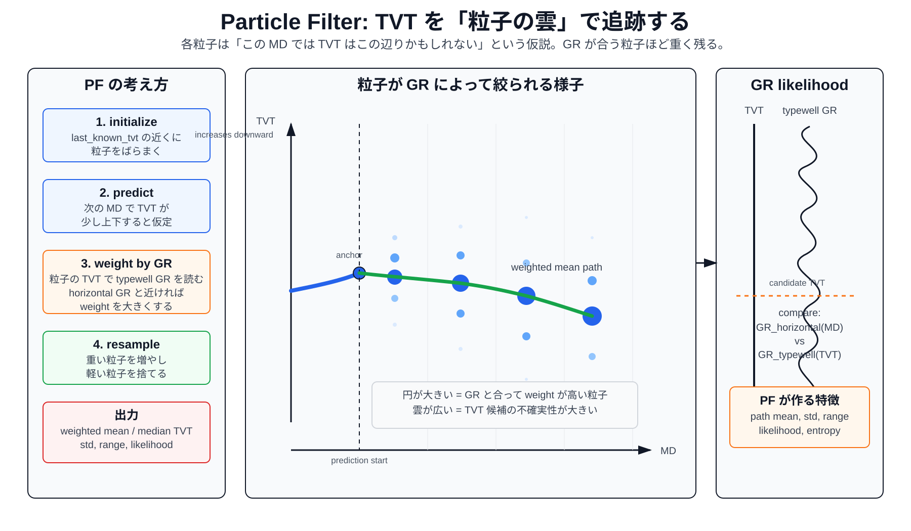
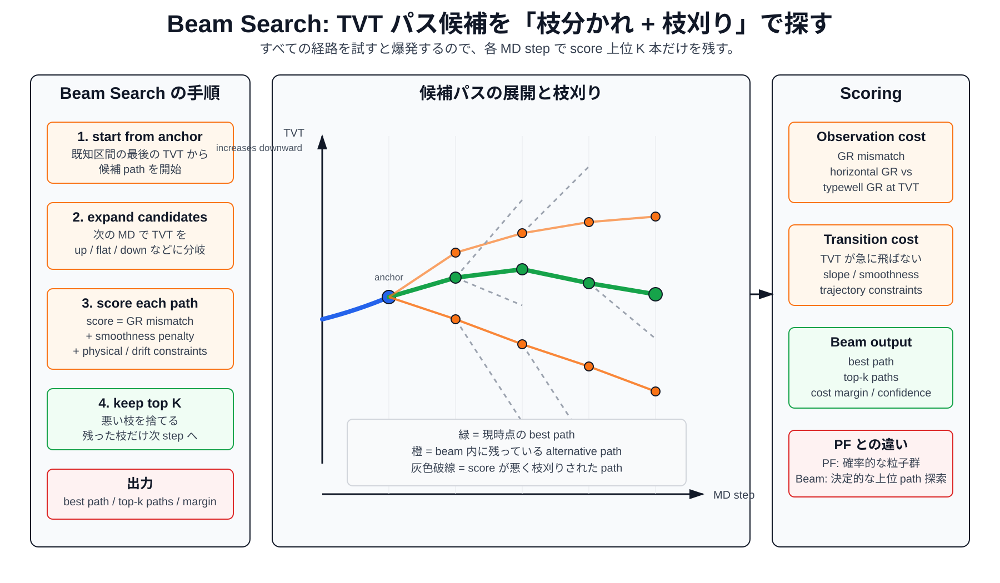

# PF / Beam Search Explainer

このメモは、ROGII の公開上位 notebook で出てくる Particle Filter、Beam Search、PF Beam route を読むための補助資料です。

## Particle Filter

Particle Filter は、予測区間の `TVT` を 1 本の線としてすぐ決めず、複数の候補点、つまり粒子として持つ方法です。

各粒子は「この MD では TVT はこの値かもしれない」という仮説です。MD が 1 step 進むたびに、粒子を少し上下に動かします。その粒子の `TVT` で typewell の `GR` を読み、horizontal well の `GR` と近ければ weight を大きくします。weight が大きい粒子を残し、小さい粒子を減らします。

重要なのは、PF の出力は単なる `tvt` 予測だけではないことです。候補分布の平均、中央値、標準偏差、range、likelihood、entropy も特徴になります。

図:

## Beam Search

Beam Search は、TVT の候補パスを枝分かれさせながら探索する方法です。

各 MD step で、現在残っている path から次の `TVT` 候補を複数展開します。たとえば `TVT` が少し上がる、横ばい、少し下がる、という候補です。それぞれの path に score を付けます。score は、typewell GR と horizontal GR の mismatch、TVT の急変ペナルティ、trajectory や smoothness の制約などで決まります。

全候補を残すと組み合わせが爆発するので、score が良い上位 `K` 本だけを残します。これが beam です。

図:

## PF と Beam Search の違い

| 項目 | Particle Filter | Beam Search |
| --- | --- | --- |
| 候補の持ち方 | 粒子の分布 | 上位 K 本の path |
| 性質 | 確率的、seed に依存しやすい | 決定的にしやすい |
| 更新方法 | predict -> weight -> resample | expand -> score -> prune |
| GR の使い方 | 粒子 weight の likelihood | path score の observation cost |
| 出力 | weighted path、分散、不確実性 | best path、top-k path、cost margin |

## ROGII での使い方

公開上位 notebook では、PF / Beam を単体で信じ切るより、次のような候補 signal として使う形が多いです。

- `candidate path`: PF / Beam が作った TVT 軌道
- `likelihood`: GR がどれだけ合っているか
- `scale selector`: well の長さ、Z span、GR 状態などで PF scale を切り替える
- `hold blend`: 予測開始直後は last_known_tvt に寄せる
- `divergence`: PF、Beam、NCC、formation guide がどれだけ食い違うか

このリポジトリでは、PF / Beam をそのまま追加した `exp015_public_pf_beam_scale_selector_features` は CV で悪化しました。再検討するなら、単純な add-only features ではなく、candidate quality audit、confidence、router、feature pruning の対象として扱うのが安全です。

