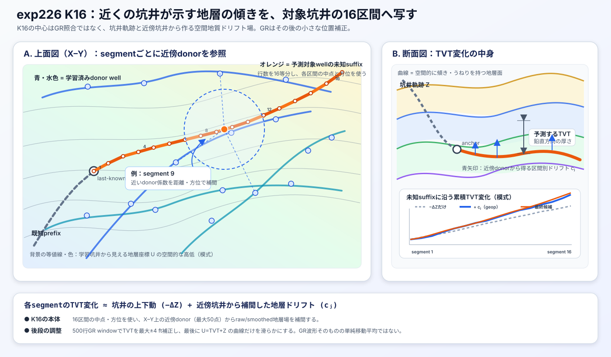

# exp264 物理モデル解説

## 結論

exp264 は、単一の物理モデルで TVT を直接決める実験ではない。坑井軌跡と GR ログに物理・幾何学的な制約を与えて
6本の primitive 候補を作り、その blend を含む12候補の「その行での信頼性」を LightGBM で評価し、最後に別の
LightGBM が連続メタ特徴として統合する `ml_model` routeである。PF/HMM/Beam候補は補助meta featureであり、
direct blend、hard-path、Viterbi、softmax TVT平均は最終予測に使わない。

物理モデル部分の中心的な仮定は次の3点である。

1. 地層に沿った座標 `U = TVT + Z` の変化率は、坑井の measured depth (`MD`) に沿って急変しにくい。
2. horizontal well の GR パターンは、typewell の `GR(TVT)` と照合できる。
3. 近接坑井では地層面の空間的な傾向を共有できる。

したがって、ここでいう「物理モデル」は厳密な地質力学シミュレータではなく、坑井幾何、地層面の滑らかさ、
ログ対応を状態遷移・観測尤度・経路コストへ落とした半物理・確率的モデルである。

```text
raw horizontal / typewell
        ↓
6 primitive 物理・幾何候補
        ↓  固定平均
6 primitive + 5 pair + 1 fixed = 12候補
        ↓
候補別 LightGBM: 予測絶対誤差 / 誤差10以内確率
        ↓
74列の連続メタ特徴
        ↓
clean 273列 + 74列を使う最終 TVT LightGBM 15本の平均
```

候補定義の正は [candidate_contract.yaml](candidate_contract.yaml)、実験全体の評価は [result.md](result.md) である。

後続の原因監査では、3系統に共通して長い同符号のvertical offsetが誤差を支配する一方、その内部原因は異なることが
分かった。HMMはrate priorとtransition history、PFは有限粒子supportと複数basinの平均、exp226はdonorから移した
相対増分の累積が主因である。詳細は「HMM・PF・exp226の誤差原因」にまとめる。

## 予測対象と入力

各 horizontal well では、前半の `TVT_input` が既知で、後半の欠損区間の TVT を予測する。物理候補が利用する
主な観測は次のとおりである。

| 種類 | 変数 | 役割 |
| --- | --- | --- |
| 坑井軌跡 | `MD`, `X`, `Y`, `Z` | MD 方向の進行、三次元位置、深度変化を表す |
| 既知アンカー | `TVT_input` の既知 prefix | 欠損区間開始時の TVT と初期傾向を決める |
| horizontal log | `GR` | 各候補 TVT が示す地層ログと観測が合うか評価する |
| typewell | `TVT`, `GR` | `GR(TVT)` の参照曲線として使う |
| 空間地質情報 | 学習坑井の位置と地層面 | K16 が近傍坑井から地層ドリフトを補間する |

公開 test の horizontal file に存在する raw 数値列は `MD/X/Y/Z/GR/TVT_input` である。exp264 の修正版では、
test に存在しない `ANCC/ASTNU/ASTNL/EGFDU/EGFDL/BUDA` の raw 値や差分を selector 特徴へ直接入れていない。
ただし K16 自体は、学習坑井側の地層面サンプルから構築した空間場を、test の `X/Y` 位置へ補間する。

## 共通する物理状態

### `U = TVT + Z` と地層変化率

PF/HMM 系では、次の地層座標を考える。

$$
U_t = TVT_t + Z_t
$$

この和の符号は正しい。このデータの`Z`は正の下向き深度ではなく、地下ほど負になるXYZ座標の鉛直成分である。一方、
`TVT`は下向きに増える正のvertical thicknessである。正の下向き深度を`D=-Z`と書けば、同じ式は

$$
U = TVT - D
$$

となる。つまり、符号が逆だからこそ`TVT+Z`で坑井自体の上下動が相殺される。平坦な地層を掘り下がる場合は
$\Delta TVT \simeq -\Delta Z$なので、$\Delta U=\Delta TVT+\Delta Z\simeq0$となる。もしこのデータの`Z`を
正の下向きTVDと誤認して`TVT-Z`を使うと、上下動を相殺せず、むしろ二重に数える。

例えばtrain well `000d7d20`の先頭2行では、`Z`は`-9258.57`から`-9259.55`へ0.98 ft下降し、`TVT`は
`11236.02`から`11237.05`へ1.03 ft増える。このとき`TVT+Z`は`1977.45`から`1977.50`へ0.05 ftしか変わらない。
全773 train wellsの有限な隣接5,091,482組でも、$corr(\Delta TVT,\Delta Z)=-0.935876$である。
$|\Delta(TVT+Z)|$はmedian 0.03、p90 0.06、mean 0.041 ftなのに対し、誤った差
$|\Delta(TVT-Z)|$はmedian 0.05、p90 1.20、mean 0.254 ftであり、和の方が地層座標として明らかに滑らかである。

その MD 方向の変化率を

$$
r_t = \frac{dU}{dMD}
$$

と置く。実装上の基本的な状態遷移は、おおむね次の形である。

$$
r_t = \rho r_{t-1} + \epsilon^r_t
$$

$$
U_t = U_{t-1} + r_t\Delta MD_t + \epsilon^U_t
$$

`TVT = U - Z` なので、TVT の増分で書けば

$$
\Delta TVT_t \simeq r_t\Delta MD_t - \Delta Z_t
$$

となる。これは「地層面の傾きは連続的に変わり、坑井の上下動 `ΔZ` を差し引くと TVT が決まる」という制約である。
初期 `U` と初期 rate は、最後の既知 TVT と、既知 prefix 末尾およそ30点から推定する。

### GR 観測モデル

内部状態として仮定した TVT を `v` とすると、typewell から補間した `GR_typewell(v)` と horizontal well の観測 GR を比較する。
Gaussian emission の基本形は

$$
\log p(GR_t \mid TVT_t=v)
\propto
-\frac{1}{2}
\left(
\frac{GR_t-GR_{typewell}(v)}{\sigma_{GR}}
\right)^2
$$

である。この尤度により、運動学的に滑らかなだけでなく、観測 GR と整合する TVT 経路を優先する。

ここでの `v` は、exp264 が最後に扱う「12本の候補 surface」のことではない。各物理モデルの内部で比較する
TVT 仮説であり、モデルごとに作り方が異なる。

| モデル | GRと比較する内部TVT仮説 | GR観測の使われ方 |
| --- | --- | --- |
| `exact_hmm` | last-known TVT周辺に0.35間隔で並べた全grid点 | 各 `(行, TVT grid)` の emissionを作り、forward-backward事後分布へ入れる |
| `selfgr_hmm_a070` | `exact_hmm`と同じ全grid点 | typewell GR emissionへself-GR motifの弱い追加尤度を足す |
| `likpf_mean` | 状態遷移からサンプルされた各particleの `U-Z` | GR尤度でparticle weightを更新し、低ESS時にresamplingする |
| `pf_ancc` | 状態遷移からサンプルされた各particleの `U-Z` | `likpf_mean`と同様にparticleを重み付けする |
| `beam_mean` | 直前pathから到達可能なtypewell index `-2...+2` | GR二乗誤差をpath costへ加え、低costのbeamだけ残す |
| `exp226_k16` | 幾何予測周辺のTVT補正grid | 500行windowのGR相関・MSE・level差から補正量をdecodeする |

したがって、先にTVTを1点選んでからGR誤差を計算するのではない。HMMは全gridを同時評価し、PFは多数のparticleを
評価し、Beamは到達可能なindexを展開する。その後に状態遷移との整合性も合わせて posterior/pathを絞る。
各物理モデルが最後に返したposterior meanやparticle mean、beam平均などが、exp264側の12候補bankへ入る。

### `σ_GR` の推定

`σ_GR` は全well共通定数ではなく、予測対象wellの既知 prefixだけからwellごとに1回推定する。未知suffixの真のTVTは
使わない。主な実装差は次のとおり。

#### `exact_hmm` / `selfgr_hmm_a070` / `likpf_mean`

1. `TVT_input` が既知の行を取り出す。
2. 各既知TVTでtypewell GRを線形補間する。
3. `e_i = GR_horizontal,i - GR_typewell(TVT_input,i)` を計算する。
4. `std(e_i)` を求め、`[10, 60]`へclipする。

式では次のとおりである。

$$
\hat{\sigma}_{GR}
= \operatorname{clip}
\left(
\operatorname{std}_{i\in prefix}
\left[GR_{h,i}-GR_{tw}(TVT_{input,i})\right],
10, 60
\right)
$$

exp264で使うHMMは `sigma_mode="std"` であり、既知prefixの欠損GRを0で補ってから標準偏差を計算する。また、
評価区間のGRは前後方向へ線形補間し、残った欠損をtypewell GR平均で埋める。HMMコードはrobust MADとaffine係数も
計算できるが、このmodeの最終emissionでは `a=1, b=0` のraw GR比較を使う。`likpf_mean` も既知prefix GRを0補完して
同じ `[10,60]` clipを使う。

#### `pf_ancc`

`TVT_input` と GR の両方が有限な既知行だけで同じ残差標準偏差を計算する。有効行が20未満なら30へfallbackし、
それ以外は `[10,60]`へclipする。欠損GRを0として残差へ入れない点がHMM/LikPFとの違いである。

#### K16とBeam

K16のGR補正は、既知prefixでhorizontal GRからtypewell GRへのrobust affine変換を当てた後の残差標準偏差を
`[5,60]`へclipし、有効点が30以下なら30とする。Beamは `σ_GR` ではなく、7設定それぞれの誤差scale `e_s` で
GR二乗誤差を割る。

### GR欠損補完とGRスムージング

ここでは、欠損値を埋める「補完」、GR値を近傍平均などで低域化する「GRスムージング」、TVT軸へ値を写す
「再サンプリング」を区別する。HMMのforward-backwardやK16最後の`U` projectionはTVT経路の平滑化であり、
GRスムージングには数えない。

| primitiveモデル | horizontal GRの欠損補完 | typewell GRの欠損補完 | GRスムージング |
| --- | --- | --- | --- |
| `exact_hmm` | **あり**。未知suffixを含む全系列を前後方向へ線形補間し、なお残る場合はtypewell GR平均で補う。`sigma_mode="std"`の既知prefix scale推定だけは欠損を0で補う | **あり**。TVT順のGRをforward fill後にbackward fillする | **なし**。補完後GRをそのままGaussian emissionへ入れる。HMMが平滑化するのはGRではなくTVT状態分布 |
| `selfgr_hmm_a070` | **あり**。base HMMの補完は`exact_hmm`と同じ。self-GR記述子も両方向線形補間し、残りを全体中央値で補う | **あり**。`exact_hmm`と同じforward/backward fill | **特徴量レベルではあり**。半径12、計25行のcentered rolling mean/stdでself-GR記述子を局所正規化する。ただしbase typewell emissionの観測GR自体を移動平均へ置換してはいない |
| `likpf_mean` | **あり**。未知suffixを両方向線形補間し、残りをtypewell GR平均で補う。既知prefixの`σ_GR`推定では欠損を0で補う | **あり**。各欠損をtypewell全体のGR平均で補う | **なし**。0.2 TVT間隔gridへの線形再サンプリングは行うが、近傍平均による平滑化ではない |
| `pf_ancc` | **なし**。未知suffixのGRをrawのまま渡し、欠損行ではGR尤度更新をスキップして運動モデルだけで進む | **明示補完なし**。raw GRを0.2 TVT間隔gridへ線形再サンプリングするだけ | **なし** |
| `beam_mean` | **あり**。全系列を両方向線形補間し、残りをtypewell GR平均で補う | **明示補完なし**。raw typewell GRを使う | **あり**。7本のbeamごとにcentered rolling meanを適用する。半径`r=1,2,3,5`、窓幅では3、5、7、11行で、最終候補は各平滑度の経路平均 |
| `exp226_k16` | **部分的にあり**。未知suffixを線形補間するが、1欠損区間につき最大10行までで、長い欠損の残りはNaNのまま。既知prefixは補完せず有限値だけで較正する | **明示補完なし**。0.5 TVT間隔へ再サンプリングし、NaNを含む候補区間は比較対象から外す | **集約の意味であり**。GR自体の単純な移動平均はしないが、500行window・125行strideで処理し、0.5のrelative-path binごとに3点以上を平均してGR profileを作る。window中心のTVT補正も行方向へ補間する |

#### なぜhorizontalとtypewellで補完方法が異なるか

第一の理由は役割と座標軸が異なるためである。horizontal GRは、MD順に並ぶ対象坑井の「時系列的な観測」である。
1行の欠損は本来「そのMD位置ではGR観測がない」ことを意味する。対してtypewell GRは、候補TVTを与えたときに
参照する`GR_typewell(TVT)`というlookup curveであり、欠損が残ると特定TVTの全particle/grid/pathで期待GRを
評価できなくなる。したがって、horizontal側は欠損行の尤度をskipできる一方、typewell側は連続な参照曲線を
作りたくなる、という非対称性自体には合理性がある。

第二の理由は各アルゴリズムの計算要件である。HMM、LikPF、Beamは毎行または全TVT gridで有限なGR誤差を必要とする
実装なので、先に値を埋めて計算を単純化している。`pf_ancc`は欠損判定を尤度更新内に持つため、補完せずその行を
運動モデルだけで進められる。K16はwindow単位の比較なので、短い穴だけ埋め、不十分なwindowやNaNを含む
typewell候補を捨てられる。

第三に、現在の細かなルールは統一方針から決めたものではない。6 primitiveは別々の公開notebook・親実験から継承され、
`ffill/bfill`、全体平均、尤度skip、最大10行補間が混在している。これらの方法だけを揃えて比較するmatched ablationは
行われておらず、コードにも「このデータではこの補完が最適」という根拠はない。したがって、方法の違いすべてが
物理的必然なのではなく、かなりの部分が実装系譜と防御的なNaN処理による。

原理的には、両者を次のように扱う方が整合的である。

- horizontalはMD軸、typewellはTVT軸で、短い欠損だけ線形補間する。
- 長いhorizontal欠損は値を作らずGR尤度をskipするか、補間距離に応じて尤度を弱める。
- 長いtypewell欠損にかかる候補TVTも無効化するか、参照GRの不確実性を大きくする。
- 補間値には元の観測と同じ重みを与えず、欠損mask・連続欠損長・最近傍実測点までの距離をconfidenceへ反映する。

この観点では、現在の`pf_ancc`とK16は長い欠損を過信しにくい。一方、全欠損を補って同じGaussian emissionへ入れる
HMM/LikPF/Beamは、長い欠損でも疑似観測を連続して数えるため過信の可能性がある。typewellのforward fillや全体平均も
計算を有限にするには便利だが、地層ログ形状として自然とは限らない。現在の違いは候補間の失敗モードを多様化する効果は
あるものの、単体モデルの前処理として最適だと確認されたわけではない。

この差は、長いGR欠損区間で特に重要である。`exact_hmm`、`selfgr_hmm_a070`、`likpf_mean`、`beam_mean`は
補間値を実観測と同様に連続したGR evidenceとして使う。一方、`pf_ancc`は欠損行を観測なしとして扱うため、
その区間では状態遷移の影響が強くなる。K16は両者の中間で、短い穴だけ補い、長い穴を含むwindowはGR補正が
弱くなるか無効になる。

固定50:50 pairと`exp226_w500_50_50`は、primitiveが出したTVT予測を平均するだけで、新たなGR補完・
GRスムージングは行わない。そのため、表に示した構成primitiveの前処理をそのまま継承する。

### GR誤差を二乗することは適切か

二乗誤差は一般的である。観測誤差が独立・同分散のGaussian
`ε ~ N(0, σ_GR²)`なら、負の対数尤度は定数を除いて `0.5*(ε/σ_GR)²`となる。大きな不一致を強く罰し、
微分可能で扱いやすいため、最小二乗、Kalman filter、HMM、PFで標準的に使われる。

ただし、コンペ評価がTVTのRMSEだからGR誤差も二乗すべき、という直接の関係はない。前者は最終TVT誤差、後者は
状態推定用の観測分布である。posteriorが正しく校正されていれば、RMSEに対してposterior meanを返すことは整合的だが、
その前提としてGR尤度自体が現実的である必要がある。

今回のtrain 773 wellsの既知prefixを読み取り専用で集計すると、次の性質がある。重い裾の診断値はGRが有限の行だけ、
HMM実装値は欠損GRを0補完する実際の式で計算した。

- 有限GRだけから求めたwell別残差scaleの中央値は13.90、p05/p95は10.00/20.73だった。
- 欠損GRを0補完する実際のHMM `σ_GR` は中央値38.64、p05/p95は19.47/59.28で、4.27%のwellが上限60へ
  到達した。欠損補完によって観測尤度がかなり緩くなるwellがある。
- 有限GR残差を有限行だけのscaleで標準化するとexcess kurtosisは9.23で、Gaussianの0よりかなり裾が重い。
- 同じ標準化で `|residual| > 3σ` は1.40%で、標準Gaussianの約0.27%より多い。
- 残差のwell内相関中央値は1行lagで0.724、5行lagで0.243、20行lagでも0.129。MD刻みは全行1 ftなので、
  GR evidenceは独立ではない。
- 既知prefixのGR欠損率中央値は20.3%で、補間GRにも連続した疑似観測として尤度を与えている。

このため、Gaussian二乗誤差は「単純で強い基準モデル」としては妥当だが、「正しく校正された独立Gaussian尤度」としては
適切とは言い切れない。重い裾では外れ値がwrong depthへの強い引力になり、系列相関を無視すると同じGR eventを
何度も観測したかのように過信する。GR模様の反復によるdepth aliasも、二乗誤差だけでは解消できない。

一方、単純にrobust化すれば改善するわけでもない。exp232のtarget-free gated temperature `T=2/4` はGaussian PFより
RMSEを約+1.93悪化させ、exp233のUniform-GR outlier mixtureも約+1.93以上悪化した。prefix affine補正もexp211のPFでは
+2.54悪化した。現時点では、raw Gaussianを固定し、Self-GR、状態遷移、複数モデルblend、selector disagreementで
弱点を吸収する構成が実証上は最も安全である。比較結果は
[exp232](../exp232_adaptive_robust_likelihood_pf/result.md)、
[exp233](../exp233_adaptive_outlier_mixture_likelihood_pf/result.md)、
[exp211](../exp211_affine_calibrated_gr_observation_pfbeam/result.md)を参照。

今後見直すなら、Student-t/Huber emission、GR相関長に応じたlikelihood tempering/downsampling、欠損補間の不確実性、
well/区間別のheteroscedastic `σ_GR`を、同じGroupKFold・long-tail guardで比較する必要がある。HMM実装には
Student-t emissionのコード経路があるが、exp264の候補bankではGaussianを使用しており、両者のfull 773-well
matched sweepは行っていない。

注意点として、GR 形状は異なる TVT 位置でも似ることがある。この多峰性・曖昧性を、HMM は事後分布、PF は粒子群、
Beam は複数の経路設定、exp264 は候補間 disagreement として扱っている。

## 6本の primitive 物理・幾何候補

### 1. `exp226_k16`: 空間地質面 + 坑井幾何

最も精度の高い単体候補で、確率的な PF/HMM ではなく決定論的な空間幾何モデルである。

考え方を簡略化すると、「学習坑井ごとにTVTの地層ドリフトを16区間の傾きへ分解し、その傾きを近傍坑井から
対象坑井の位置へ補間する」モデルである。

$$
\underbrace{TVT_t-TVT_{anchor}}_{\text{実際のTVT変化}}
=
\underbrace{\sum_{k\le t}(-\Delta Z_k)}_{\text{坑井軌跡だけの変化}}
+
\underbrace{\sum_{j=1}^{16}c_j\phi_j(t)}_{\text{地層面による追加ドリフト}}
$$

上式の `φ_j(t)` はsegment `j` 内では線形に増え、segment通過後は一定になる累積basisである。各donor wellから
係数 `c_j` とsegment midpoint/方位を作り、対象wellでは近いdonorの係数場を `X/Y` 上で局所線形補間する。



図の左側は上から見た`X/Y`空間である。オレンジの対象坑井を16区間へ分け、各区間の中点・方位に対して、
青いdonor坑井のsegment係数を近傍検索する。つまり「donor坑井全体のTVTをコピーする」のではなく、
その場所・方向で`-ΔZ`にどれだけ地層ドリフトを足すかを局所補間している。

図の右側は横から見た断面である。灰色破線は坑井の上下動`-ΔZ`だけを累積した変化、青線は16区間の
地層ドリフト`c_j`を足した幾何予測`geop`、橙線は後段のGR補正と`U` projectionを含む最終候補を表す。
GRは地層面を作る主入力ではなく、幾何予測ができた後に最大`±4 ft`だけ位置を調整する役割である。

- 欠損区間の坑井軌跡を16 segment に分割する。
- 学習坑井から得た segment ごとの地層ドリフトを、対象 segment の `X/Y` 周辺にある近傍50点から
  bandwidth 500 の局所線形回帰で補間する。
- raw field と平滑化 field、donor 距離帯、坑井方位と地層 strike の関係から12個の設計項を作り、
  fold 内で `kappa` を当てはめる。
- near-strike 区間では、学習坑井の ANCC 面から局所的な地層方向を推定する補助 committee を使う。
- typewell と horizontal GR の対応から TVT 補正を加える。
- 最後に `U = TVT + Z` を4次多項式へ robust projection し、局所的な振動を抑える。補正前予測と
  projection の重みは25:75である。

この候補は近接坑井の地層構造を使える点が強い。一方、donor が遠い、地層面が局所的に急変する、GR 対応が曖昧、
という場合に外れやすい。native confidence として GR 補正量 `geometry_gr_delta` を exp264 へ渡す。

主要設定は K=16、kNN=50、bandwidth=500、基準方位 `theta0=118.4°` である。実装の詳細は
[exp226 の再現コード](../exp226_connortynan_k16_spline_kernel_knn_adaptive_kappa_reproduction/connortynan_k16_reproduction.py)を参照。

#### exp226_k16に追加のGR欠損補完・GRスムージングは有効か

結論からいうと、**現行の限定的なGR処理には明確な正の効果があるが、補完範囲を広げたり単純な移動平均を追加すれば
さらに良くなる、とは判断できない**。むしろ、長い欠損の全面補間と追加の強い平滑化は悪化する可能性が高い。

現行実装はすでに次の処理を行っている。

- horizontal suffix GRは線形補間するが、連続欠損ごとに最大10行までに制限する。残りはNaNのままにする。
- 500行window内のfinite GRが50%未満なら、そのwindowのGR emissionを作らない。
- horizontal GRをrelative-path 0.5 ft binへ集約し、同じbinに3点以上ある場合だけ平均する。この時点で高周波noiseは
  ある程度平均化されている。
- typewell側にNaNを含むTVT候補区間は比較対象から外す。
- GR補正量はposterior uncertaintyで縮小し、最後に`[-4,+4] ft`へclipする。
- 最後のrobust 4次`U` projectionが滑らかにするのはTVT経路であり、GR波形そのものではない。

保存済みgroup-safe OOF 3,783,989行を、同じexp226出力内の中間成分で再集計すると次のようになる。

| exp226内部経路 | RMSE | 直前からの変化 |
| --- | ---: | ---: |
| 空間幾何だけの`geop` | 10.077950 | - |
| `geop +` 現行GR補正 | 9.500816 | **-0.577134** |
| さらに現行`U` projectionを適用した最終K16 | 9.427110 | **-0.073707** |

GR補正は99.973%の行で非ゼロとなり、`|GR補正|`の中央値は1.957 ft、p95はclip上限の4 ftだった。したがって、
「GR処理を外す」「GR形状を大きく潰す」方向は、現在のOOF証拠とは合わない。一方、この比較は現行GR補正の総効果であり、
最大10行の補間だけの因果効果や、別の平滑化幅の効果を分離したablationではない。

raw horizontal GRが有限な行と欠損行に分けても、幾何予測から現行GR補正へのRMSE変化はそれぞれ
`-0.546396 / -0.649869 ft`だった。ただし、欠損行の補正は500行window内の周辺観測からも伝播するため、
この数値を「欠損値そのものを補間した効果」と解釈してはいけない。

| 変更案 | 現時点の判断 | 理由 |
| --- | --- | --- |
| 10行を超える長い欠損も全面線形補間 | 非推奨 | 人工的な直線profileを実測GRのように相関へ数え、誤ったTVT shiftを強める可能性がある |
| 補間GRを実測GRより弱く数える、または長欠損windowをskip | **検証価値あり** | 現行の「50% finite未満はskip」を連続的なconfidenceへ一般化でき、観測を捏造しない |
| horizontal GRだけへ追加の移動平均 | 非推奨 | 0.5 ft bin平均と500行windowですでに集約されており、typewellとのpeak対応を片側だけぼかす |
| horizontal/typewellを同じTVT相当scaleで弱く平滑化 | 不明・低優先 | noise低減の可能性はあるが、鋭いGR eventを失う。両側同一処理のmatched ablationが必要 |

したがって、次に試すなら「補完値を増やす」より、raw missing maskと実測点までの距離を保持したまま、
補間GRのbin寄与を弱める案が先である。現行、no-fill、missing-confidenceの3条件で、幾何`geop`、GR補正後、
最終K16を同じGroupKFold・1000+・hidden-like・worst-wellで比較する必要がある。追加の単純GR smoothingは、
その後にhorizontal/typewell両側へ同じ処理を施す単一設定として検証すべきである。

#### なぜ16 segmentか、適切か

16はexp226/exp264で探索して選んだ値ではない。Connor Tynan公開notebookの `K=16` を、deterministic v6 fallbackの
再現条件としてそのまま継承した。exp226はK=16の1 variantだけをGroupKFoldで評価しており、K=8/12/24/32などとの
matched sweepは行っていない。

segment境界はMD距離ではなく、unknown suffixの行番号を `linspace(0, n, 17)` で等分して決める。ただしtrainの
MD刻みは全行1 ftなので、実質的にはほぼ等MD長である。773 wellsを集計すると、1 segmentのMD長は中央値302.4 ft、
p05/p95は184.2/432.3 ft、全範囲は25.4〜628.2 ftだった。

Kを小さくするとdonor係数は安定するが局所的な方位・地層変化を平均化する。Kを大きくすると局所変化を表現できるが、
1 segmentの観測が減り、donor fieldと方位推定が不安定になる。K=16は平均的なwellで約300 ft単位の変化を表す
妥当な中間値で、単体OOF 9.427という実績もある。ただし、固定Kのため短いwellでは約25 ft、長いwellでは約628 ftまで
解像度が変わり、最適性は証明されていない。

結論は「K=16は有効な公開由来baselineだが、データから再選択した最適値ではない」。厳密に判断するには、同一outer
GroupKFold、同一donor除外、同一GR/U補正でKだけを変え、pooled RMSEだけでなく1000+、hidden-like、worst-wellを
比較する必要がある。固定MD幅segmentや、well長に応じてKを変える方法も比較対象になる。

### 2. `exact_hmm`: TVT位置 × rate の exact HMM smoother

離散状態を `(TVT位置, Uのrate)` とする二次の Hidden Markov Model である。

- TVT grid 幅は0.35、rate は41状態。
- rate は momentum `0.998` で滑らかに遷移し、rate noise scale は `0.002√ΔMD`。
- TVT位置は `rΔMD - ΔZ` だけ進むことを中心に、設定上の position noise は `0.02`。離散 grid 上では
  `max(0.02, 0.35×grid幅)` が使われるため、grid幅0.35での実効下限は0.1225である。
- 各 TVT grid 点の emission は typewell GR との Gaussian mismatch。
- forward-backward により全欠損区間を平滑化し、各行の posterior mean を TVT 候補、posterior standard deviation を
  `sigma_tvt` とする。

逐次的な最尤経路を1本だけ選ぶのではなく、未来側の観測も含む平滑化事後分布を使うのが特徴である。
一方、TVT grid と rate grid の範囲・解像度に依存し、GR が反復パターンを持つ場合は複数モードを平均して
中間的な TVT を返す可能性がある。

実装は [exact_hmm_smoother.py](../exp209_exp072_exp205_joint_exact_parity_fast_cache_generation/exact_hmm_smoother.py) を参照。

#### TVT grid幅0.35と41 rate状態はどう決まったか

この2値もexp264で探索して決めたものではない。amerhu公開notebookのdefault
`step=0.35, n_rates=41, rate_span=0.10`をexp205が数値変更を抑えて移植し、exp209がparityを維持した後、
exp223/exp263/exp264へ固定継承した。公開notebook自身も「sample wellsで検証したdefaultで、full harnessで再調整すべき」
という位置付けである。したがって、773 wellsのgroup-safe grid searchで最適化済みという根拠はない。

TVT gridは、最後の既知TVTを中心とした概ね±100 ftのbandを0.35 ft刻みで離散化する。rateは通常
`[-0.10, +0.10]`を41点へ分けるため、刻みは0.005、奇数状態なので0を正確に含む。実装ではprefix末尾から得た
初期rateを `r0` とし、`|r0|+0.04 > 0.10`ならspanを動的に広げる。

データとの対応は次のとおり。

- typewell TVT刻みは中央値0.5 ft、p05/p95は0.25/0.5 ftなので、0.35 ft gridは参照ログと同程度か細かい。
- train 773 wellsのprefix末尾30行から求めた `|r0|` は中央値0.03、p95 0.06、最大0.08。nominal ±0.10で
  今回観測した初期rateを覆い、動的拡張もある。
- horizontal MD刻みは1 ftで、nominal rate刻み0.005はrate noise scale 0.002に対して約2.5倍。
- posterior meanは複数grid点の加重平均なので、最終TVT出力自体が0.35刻みに量子化されるわけではない。

以上から、0.35/41は解像度と計算量の妥当な折衷に見える。TVT誤差が約8〜12 ftであることを考えると0.35 ftは十分細かく、
rate spanも既知prefix末尾の分布を覆う。一方で、fault後の急なrate変化、GR alias、長いsuffixで必要なrate範囲までは
prefix統計だけで保証できない。stepを変えると、位置遷移kernelの実効sigma下限 `0.35*step` も変わるため、grid幅だけを
独立に調整するのも不十分である。

結論は「候補・blend要素としては適切な精度だが、最適とは未確認」。exact HMM単体RMSE 11.938に対し、K16との
50:50 blendは8.635、固定3者blendは8.238まで改善したので補完性は確認できる。しかしfull-dataで
`step={0.25,0.35,0.5}`、`n_rates={21,41,81}`、rate span/process noiseを共同比較した証拠はない。
評価する場合は、runtimeも大きく変わるため、同じmulti-cut/outer GroupKFoldとtail guardで比較すべきである。

パラメータ継承の記録は
[exp205](../exp205_exact_hmm_smoother_exp072_compatible_cache_audit/result.md)と
[exp209](../exp209_exp072_exp205_joint_exact_parity_fast_cache_generation/result.md)を参照。

### 3. `selfgr_hmm_a070`: typewell GR + 同一坑井 prefix motif HMM

`exact_hmm` の状態遷移と typewell GR emission を維持し、同じ horizontal well の既知 prefix に現れた
局所 GR motif を弱い追加尤度として使う。

- GR window descriptor は中心の前後12行、既知 prefix anchor は最大128点、直近32点を優先して保持する。
- 評価行の descriptor に近い prefix motif を最大5件探し、それらの既知 TVT の周囲へ Gaussian surface
  (`sigma_tvt=12`) を置く。
- motif の鋭さ、1位と2位の距離差、欠損率、typewell 側ピークとの一致度から行ごとの quality を作る。
- `boost_only` として正の self-GR evidence だけを clip 1.0、重み `alpha=0.07` で typewell emission に加える。

同一坑井固有の GR 模様を再利用できる反面、prefix 内に似た motif が少ない場合や、別地層で似た模様が繰り返す場合は
誤対応のリスクがある。このため `selfgr_quality`、peak TVT、1位/2位 gap、typewell agreement、validity も
confidence として保持する。

実装は [exp223 HMM](../exp223_joint_typewell_self_gr_hmm_likelihood_probe/exact_hmm_smoother.py) を参照。

### 4. `likpf_mean`: 128 seed likelihood-weighted Particle Filter

状態を `(U, rate)` とする逐次 Monte Carlo 法である。

- 1 seed あたり500 particles、128個の stable seed trajectory を生成する。
- `rate_t = 0.998 rate_(t-1) + N(0, 0.002²)` とし、`U` は `rate × ΔMD` と position noise 0.005で進める。
- 各行で typewell GR との Gaussian likelihood を粒子重みに掛ける。
- effective sample size が粒子数の50%を下回ると systematic resampling し、位置と rate を少し roughening する。
- 各 seed の粒子加重平均 TVT を作り、`likpf_mean` は128 seed の予測を等重み平均する。

非線形・多峰な状態分布を表現できるが、有限粒子と乱数 seed による Monte Carlo 誤差がある。exp264 で使った
保存済み mean は 500 particles × 128 seeds の再生と最大絶対差0で一致を確認している。

### 5. `pf_ancc`: 単一 seed PF と posterior spread

基本状態と GR 尤度は `likpf_mean` に近いが、600 particles の単一 PF として動作し、各行で粒子 TVT の
標準偏差を直接出す。

- rate momentum `0.998`、rate noise `0.002`、position noise `0.005`。
- ESS が50%未満で resampling。
- 候補値は粒子加重平均、`sigma_tvt` は粒子群の加重標準偏差。

`pf_ancc` は履歴上の candidate 名であり、current-test 推論で horizontal の raw `ANCC` 列を要求するという意味ではない。
候補値そのものの RMSE は弱いが、他候補と異なる失敗・不確実性を持つ reserve candidate として残している。

`likpf_mean` と `pf_ancc` の実装は
[public replay 実装](../exp072_exp063_full_replay_feature_cache/public_notebook_replay_audit.py)を参照。

### 6. `beam_mean`: GR 対応経路の Beam Search

typewell の TVT index 上で、各 horizontal GR 行に対応する経路を探索する決定論的モデルである。1 step で許す
index 移動は `-2, -1, 0, 1, 2` で、累積コストは概ね

$$
C_t = C_{t-1}
+ \frac{(GR_t-GR_{typewell}(i_t))^2}{e_s}
+ m_c |i_t-i_{t-1}|
$$

となる。第1項は GR 不一致、第2項は急な移動への罰則である。beam 幅、移動罰則、GR 誤差 scale、平滑化窓を変えた
7設定の最良経路を求め、その TVT 平均を `beam_mean`、設定間標準偏差を `beam_family_std` とする。

探索は高速で解釈しやすいが、許容移動が局所的であり、初期位置や反復 GR パターンに影響される。単体精度は6候補中
最も弱い一方、最終モデルでは `beam_mean` の予測誤差 score が重要な regime/risk 指標になった。

## 固定 blend 候補

primitive の誤差を相殺するため、exp264 は次の6本も候補として score する。

| 候補 | 式 |
| --- | --- |
| K16 + self-GR HMM | `0.5*K16 + 0.5*selfgr_hmm_a070` |
| K16 + exact HMM | `0.5*K16 + 0.5*exact_hmm` |
| K16 + LikPF | `0.5*K16 + 0.5*likpf_mean` |
| self-GR HMM + LikPF | `0.5*selfgr_hmm_a070 + 0.5*likpf_mean` |
| LikPF + exact HMM | `0.5*likpf_mean + 0.5*exact_hmm` |
| `exp226_w500_50_50` | `0.5*K16 + 0.25*likpf_mean + 0.25*exact_hmm` |

最後の固定式が、物理候補だけで作る最良の OOF anchor である。pair と named fixed は探索由来が異なるため、
12本を一つの hard-select domain にはせず、11本の primitive+pair bank と7本の primitive+fixed bank に分ける。

## HMM・PF・exp226の誤差原因

### 監査対象と共通する誤差形

ここでいうHMM、PF、exp226はアルゴリズム一般ではなく、exp264へ入る次の保存候補を指す。

| 略称 | 監査した候補 | 読出し |
| --- | --- | --- |
| HMM | exp209 `exact_hmm` | forward-backward posterior mean |
| PF | exp072 `likpf_mean` | 500 particles × 128 seedsの算術平均 |
| exp226 | group-safe deterministic v6 `exp226_k16` | geometry + GR correction + U projection |

3監査とも、約10 ft以上の誤差が128行以上続く区間をpersistent-offset episodeとして、truthを予測生成後に
late joinして原因を調べた。HMM/PFとexp226では10 ft境界の不等号や排他的原因の定義がわずかに異なるため、
原因別SSE比は各モデル内の順位として読む。モデル間の性能差を直接表す値ではない。

| 候補 | episode wells | episodes | episode rows | 全OOF row比 | 全OOF SSE比 |
| --- | ---: | ---: | ---: | ---: | ---: |
| HMM | 450 / 773 | 638 | 807,710 | 21.3455% | 91.9880% |
| PF | 496 / 773 | 839 | 819,288 | 21.6514% | 89.0753% |
| exp226 | 449 / 773 | 645 | 718,744 | 18.9943% | 82.0073% |

PFの全OOF比は、保存済み全OOF RMSE `11.594897672`、3,783,989行、episode SSE
`453,149,095.609`から再計算した。どの候補でも、全行の約2割にある長いoffsetがSSEの8〜9割を占める。
散発的な外れ値より、局所shapeはおおむね保ったままabsolute datumだけが平行にずれることが主要な誤差形である。

### HMM: rate under-responseからtranslation-gauge lockへ入る

HMMの主な因果鎖は次のとおりである。

1. suffix開始時のprefix rate posteriorとstickyなrate transitionが、真の持続的なrate変化へ十分に追従しない。
2. 0方向へのrate under-responseが小さなposition変位誤差を数百行かけて積み上げる。
3. position transitionは前後差だけを見るため、path全体の一定平行移動に不変である。suffix途中にabsolute
   positionの再anchorがないため、rateが再同期しても累積したdatum差は戻らない。
4. future側のtransition/GRを含むbackward messageと、sum-productで多数のpath massを足すことが、
   形成済みのwrong-datum basinを固定または増幅する。

exp408のactual-message直接監査による排他的分類は次のとおりである。

| HMM内部原因 | episode数 | episode SSE比 | 解釈 |
| --- | ---: | ---: | --- |
| forward transition / prior hysteresis | 452 | **59.3978%** | current emission前に既にwrong basinへ偏る主経路 |
| backward smoothing reversal | 86 | **23.0444%** | future evidenceがfiltered truth massを別datumへ戻す |
| sum-product path multiplicity | 37 | **9.0396%** | 排他的には小さいが、重複ありではSSE 72.0915%の広い増幅器 |
| state support不足 | 18 | **6.3949%** | grid/rate support不足は一部に限定 |
| raw GR / imputation alias | 0 | **0%** | current-row GRによる即時mode switchは全体主因ではない |

filtered rateが真値と同方向だが絶対値の小さいunder-responseはepisode rowsの70.9074%、
SSEの70.3580%を占めた。episode平均のtransition変位誤差とposition offsetはSSE加重で90.2246%同符号だった。
一方、current-row GRがtruth優勢からwrong優勢へ新規反転させたのは807,710行中9行だけである。

したがって「GR matchingがその行で別depthへ飛ばす」が一般的なroot causeではない。ただしGRが無関係なのでもない。
弱く相関したGR evidenceがhistoryやfuture messageへ長時間蓄積し、一部episodeをseedまたはlockする条件因子にはなる。
同様に、0.35 ft gridのposition-kernel shrinkageは正しいrate状態の合成系ではdriftを作れるが、actual exp209では
誤ったrate外挿を抑えるregularizerにもなっており、無条件の単独原因ではない。

global Viterbiはpersistent区間の多くでposterior meanより良いが、5 ft以内まで解消するepisodeは21.47%だけで、
全行置換ではRMSEが悪化した。したがってdecoderをposterior meanからViterbiへ一律変更するだけでは解決しない。

### PF: 有限粒子supportと複数basinの算術平均

PFはHMMと同じ難しいGR/geometry区間で外れることが多いが、支配的な内部原因は異なる。真値近傍のparticle/seed
supportが薄くなるか失われることと、残った複数basinをseed内・seed間で算術平均することが主因である。

| PF内部原因 | episode数 | episode SSE比 | 解釈 |
| --- | ---: | ---: | --- |
| particle support不足 | 122 | **36.4701%** | hard clampではなく有限粒子supportの不足 |
| 128 seed間の算術平均multiplicity | 314 | **36.2441%** | 良いseedが残っても別basinとの平均がoffsetになる |
| seed内particle平均multiplicity | 313 | **10.8561%** | 一つのseed内でも複数particle basinを平均する |
| transition propagation escape | 39 | **10.7177%** | HMM型のtransition原因は副経路 |
| observed GR emission alias | 15 | **3.6664%** | 一部のtriggerだが全体主因ではない |
| resampling extinction | 5 | **0.7577%** | 各行resampling直後の一斉消失説は不支持 |

重複を許すとparticle support不足は390 episodes、SSEの83.6379%に存在する。真値がhard clamp外にある行は0だったため、
`support_or_clamp_shortage`の実体は探索範囲のhard boundではなく有限標本supportである。また、128 seed中の最良seedが
算術平均より5 ft以上良い行は79.3253%、10 ft以上良い行も62.3910%あり、別basinのseedが残っていても均等平均で
取り出せないことが分かる。

GR updateはepisode全体ではSSEをわずかに改善し、固定sentinelでGRをほぼ無効化するとepisode SSEは8.8351倍へ悪化した。
GRは一部でalias triggerになっても、全体としては主に修正力である。resampling直後のmajority-seed extinctionは0行で、
resampling無効化もSSE 3.4809倍のcatastrophic outlierを作ったため、単純なresampling extinction説も棄却する。

一方、固定12 sentinel wellsではroughening 10倍がepisode SSEを0.7530倍、process noise 3倍が0.8917倍へ下げた。
これはresampling時の多様性と後続genealogyを含む有限supportが因果レバーである証拠だが、改善はwell間で不均一で、
truth-lateに選んだ小規模監査である。全OOFに一般化した採用候補ではない。単純seed median、particle mode、
global GR sigma緩和、resampling無効化、clamp拡張はいずれも安全な解決にならなかった。

### exp226: donor増分の小さなずれを再anchorなしで累積する

exp226は確率的なmode探索ではない。最後の既知`TVT_input`を一度だけabsolute anchorとし、unknown suffixでは
空間donorから補間したK16区間ごとの`TVT+Z`相対増分を積分してpathを作る。target wellの局所構造とdonor fieldの
増分に`0.02〜0.04 ft/row`程度のsigned rate mismatchがあると、後続のabsolute anchorがないため長いsuffixで累積する。
その誤差はK16境界でjumpせず、次segmentへほぼ一定offsetとして連続的に持ち越される。

低周波誤差への集中は次のoracle診断で確認された。oracleはtruthを使う構造診断であり、test-time correctionではない。

| exp226誤差から除いた成分 | 補正後RMSE | 説明MSE |
| --- | ---: | ---: |
| well mean offset | 5.777591 | 62.4391% |
| well affine offset + slope | 4.042230 | 81.6141% |
| K16 segment mean offset | 1.130603 | 98.5617% |
| K16 segment affine offset + slope | 0.403654 | 99.8167% |

final RMSEはsuffix 0〜50行の1.741257から2000行以降の11.151214へ増えた。一方、segment境界のerror jump中央値は
0.008190 ft、p95でも0.031782 ftであり、K16境界の不連続が原因ではない。K16 segment meanはsegment start errorと
Pearson 0.981710、前segment end errorと0.982951で、前区間のdatum誤差を継承している。

stage別にはgeometry `10.077950`、GR補正後`9.500816`、U projection後`9.427110`と、GRもU projectionもpooledでは
改善する。ただしGRは最大`±4 ft`の弱いwindow補正、U projectionはabsolute datumを観測しないsmoothness priorであるため、
累積offsetを一意に戻せない。episode onsetの23.57%はGR後、21.86%はU projection後に初めて10 ftを超えたが、
これらは一部wellでのproximal triggerであってroot mechanismではない。

主要なrisk amplifierはdonor extrapolationである。well RMSEとのSpearmanはdonor distance minが+0.317283、
maxが+0.337118、suffix TVT rangeが+0.387342だった。遠距離binのkappaもfold間でsign flipまたは広いrangeを持つ。
したがって根本構造は、

```text
one boundary anchor
  + spatial donorから移したrelative incrementの局所的ずれ
  + cumulative integration
  + suffix途中のabsolute re-anchorなし
  → segmentをまたいで持続するvertical offset
```

である。global bias、境界TVTの一律誤り、row order、特定fold、K16境界jump、K=16自体、GR単独、U projection単独、
deterministic v6のsource-port bugは監査で否定された。公開ソースとexp226 portの9数値核も固定synthetic入力で
最大絶対差0だった。

### 3者の違いとexp264での意味

| 観点 | HMM | PF | exp226 |
| --- | --- | --- | --- |
| 主な誤差seed | sticky/coarse rate priorの追従遅れ | 真値近傍の有限粒子support希薄化 | donorとtargetの局所増分差 |
| offsetの固定・増幅 | translation-gauge lock、future beta、path multiplicity | particle/seed basinの算術平均、genealogy | 再anchorなしの累積積分、segment間継承 |
| GRの役割 | current rowの単独主因ではなく、history/futureで一部をlock | 一部aliasだがpooledでは主に修正力 | pooledでは改善する弱い補正、一部onset trigger |
| 否定された単純原因 | current-row GR、grid量子化単独、Viterbiでの一律救済 | hard clamp、即時resampling extinction、単純median/mode | global bias、K16境界、GR/U単独、port bug |
| 有望だが未採用の方向 | rateとdatumの分離、条件付き再anchor | target-freeなsupport維持・basin weighting | donor信頼度と累積offsetの区間別confidence |

PF episodeの53.8737%はHMM episodeと重なり、その区間はPF episode SSEの78.9383%を占め、誤差方向も90.2655%一致した。
しかし内部mechanism familyが一致したのはepisodeの8.4071%、overlap SSEの10.0206%だけだった。つまりHMMとPFは
同じ曖昧な地質区間で同方向へ外れやすいが、同じアルゴリズム上の理由で失敗しているわけではない。

この差がK16/HMM/PF blendの補完性を生む一方、HMMとPFの同方向failureが多いため、単純平均だけでtail riskを消せる
わけでもない。exp264でcandidate disagreement、posterior/particle spread、K16 GR補正量、donor/contextを
連続メタ特徴として使い、hard selectionを採用しない設計はこの監査と整合する。ただし3候補すべてに共通する
「suffix途中に強いabsolute datumを安全に再導入できない」という制約は残り、extreme wellの完全な検出・回復には至っていない。

## 特徴量

### 物理候補を作る特徴

| グループ | 代表値 | 物理的な意味 |
| --- | --- | --- |
| 初期条件 | 最後の既知 TVT、`U_0`、prefix tail rate | 欠損区間開始時の位置と地層傾斜 |
| 軌跡 | `ΔMD`, `ΔZ`, `X/Y`, azimuth | 坑井が地層面をどの方向・角度で横切るか |
| ログ観測 | horizontal GR、typewell `GR(TVT)`、`σ_GR` | 候補 TVT と観測ログの整合度 |
| 空間場 | segment midpoint、donor distance、局所地層方向 | 近傍坑井から補間した地層構造 |
| 状態の滑らかさ | rate、momentum、process noise、path movement | 地層傾斜や TVT 経路の急変を抑える |
| 不確実性 | posterior/particle `sigma_tvt`、loglik、beam family std | 候補がどれだけ集中・安定しているか |

### 候補を評価する selector 88特徴

物理モデルの出力は、そのまま hard selection せず、次の candidate-long 特徴で評価する。

| group | 列数 | 内容 |
| --- | ---: | --- |
| `ctx` | 22 | MD経過、最後の既知TVT、`MD/X/Y/Z/GR`、typewell統計、欠損区間内の進行度 |
| `cand` | 13 | 候補TVT、anchor差、step、curvature、32/128/512行窓の slope/straightness |
| `bank` | 13 | 12候補のmedian/range/std、候補順位、平均との差、2 legal bank内のspread |
| `id` | 14 | 12 candidate one-hot と primitive/pair種別。ordinal indexは不使用 |
| `conf` | 12 | HMM/PFのsigma・loglik、K16 GR補正量、self-GR診断、beam family std、有効性 |
| `formula` | 14 | blend親数、親候補のrange/std/方向一致、weight entropy、親別confidence |

候補ごとに LightGBM が次の2値を予測する。

- `pred_abs_error`: その候補の予測絶対誤差。
- `p_within10`: その候補が真値から10以内に入る確率。

Stage C ではこの score を nested に生成し、候補別 score 24列、2 legal domain の top1/top2/margin、全体統計、
候補種別、top1 one-hot などへ変換した74列を後段へ渡す。selector の重要度は candidate bank の disagreement が
約55%、row/typewell context が約27〜34%であり、native confidence だけでなく「物理モデル同士がどれだけ食い違うか」が
主要な不確実性指標になっている。

最終 TVT LightGBM は、raw/replay、`U` projection、GR likelihood、GR wavelet/rotation からなる clean 273列へ
この74列を追加した347列を使う。このため最終精度は物理モデル単独の精度ではなく、物理候補と機械学習の統合精度である。

## 精度

### primitive 単体と固定 blend

全3,783,989 evaluation rows、773 wells の OOF RMSE。小さいほど良い。

| 候補 | OOF RMSE | 解釈 |
| --- | ---: | --- |
| `exp226_k16` | 9.427110 | primitive 最良。空間地質面と坑井幾何が強い |
| `selfgr_hmm_a070` | 11.349943 | exact HMM より改善するが well 単位 tail が大きい |
| `likpf_mean` | 11.594898 | 128 seed 平均で安定化した PF |
| `exact_hmm` | 11.938287 | 状態空間モデル単体 |
| `pf_ancc` | 14.493051 | 単体値より補完性・spread情報を重視 |
| `beam_mean` | 15.774327 | primitive 最弱だが異なる失敗モードを持つ |
| K16 + self-GR HMM | 8.532715 | 50:50 pair 最良 |
| K16 + exact HMM | 8.635074 | K16の空間情報とHMMのログ対応が補完 |
| K16 + LikPF | 8.813822 | K16とPFの補完 |
| self-GR HMM + LikPF | 10.123457 |  |
| LikPF + exact HMM | 10.269697 |  |
| `exp226_w500_50_50` | **8.238331** | 物理候補だけの固定 blend 最良 |

primitive 単体より blend が良いことから、空間幾何と GR ベース状態推定の誤差には補完性がある。

### Public LB audit

12候補のPublic LB censusは
[`exp434_physics_candidate_public_lb_audit`](../exp434_physics_candidate_public_lb_audit/README.md)
として設計を固定した。新しい候補やweightを作る実験ではなく、上表と同じ6 primitive、
5つの固定50:50 pair、固定3-way blendだけをhidden-safeに提出してOOF/LB順位を記録する。

exp434の正規Kaggle Notebookは通常9候補と同一性gateで追加されたLikPFの
計10 versionを完走し、全件でoutput取得、submit-check、competition scoringを
完了した。既存提出から再利用した2件と合わせた全12候補は次のとおりである。

| 候補 | OOF RMSE | Public LB | 状態 |
| --- | ---: | ---: | --- |
| `exp226_k16` | 9.427110 | 9.837 | exp226 ref `54491603`。exp434候補と最大`0.000488265 ft`でgate PASS |
| `exp226_w500_50_50` | 8.238331 | 7.800 | exp263 ref `54761954`。version 2/3のsubmission SHA一致 |
| `exp226_k16__selfgr_hmm_a070` | 8.532715 | 7.913 | exp434 ref `55083262`、COMPLETE |
| `exp226_k16__exact_hmm` | 8.635074 | **7.678** | exp434 ref `55083266`、COMPLETE。全12候補中のLB最良 |
| `exp226_k16__likpf_mean` | 8.813822 | 8.365 | exp434 ref `55083270`、COMPLETE |
| `selfgr_hmm_a070__likpf_mean` | 10.123457 | 8.812 | exp434 ref `55105249`、COMPLETE |
| `likpf_mean__exact_hmm` | 10.269697 | 8.642 | exp434 ref `55105256`、COMPLETE |
| `selfgr_hmm_a070` | 11.349943 | 9.318 | exp434 ref `55105261`、COMPLETE |
| `likpf_mean` | 11.594898 | 9.807 | exp434 ref `55133074`、COMPLETE。SHA256 seed版 |
| `exact_hmm` | 11.938287 | 9.063 | exp434 ref `55105266`、COMPLETE |
| `pf_ancc` | 14.493051 | 12.061 | exp434 ref `55133068`、COMPLETE |
| `beam_mean` | 15.774327 | 15.563 | exp434 ref `55133072`、COMPLETE |

LikPFはexp069 v3 ref `53706005`の既存LB`9.721`があるが、exp434再生成値との
最大差が`4.7783203125 ft`でgate FAILしたため、同じ候補のLBとして流用しない。
事前登録済みfailure policyに従ってexp434 version 10でLikPFを追加生成し、
submit-checkまでPASSした。

5 pair、4 primitive、条件付きLikPFの計10候補は凍結順序どおり提出・採点済みで、
全12候補のcensusが完了した。primitiveのLB順位は
`exact_hmm 9.063 < selfgr_hmm_a070 9.318 < likpf_mean 9.807 <
exp226_k16 9.837 < pf_ancc 12.061 < beam_mean 15.563`となった。K16は
OOF 5位からLB 10位、exact HMMはOOF 10位からLB 7位へ逆転した。LikPFとの
pairでもexact-HMM pair `8.642`がself-GR pair `8.812`を上回った。
全12候補のOOF/LB Spearman順位相関は`0.846154`である。全10候補の
package/prediction/submission SHAと提出refはexp434の`kaggle_run_ledger.json`に
記録した。このLB順位からweight tuningや候補の自動採用は行わない。

### selector の精度

fold-safe な nested Stage C v6 の結果は次のとおり。

| 指標 | selector | 候補別 prior | 判定 |
| --- | ---: | ---: | --- |
| 予測絶対誤差の MAE | 3.798819 | 5.788783 | 5/5 folds 改善 |
| within10 logloss | 0.359412 | 0.510131 | 5/5 folds 改善 |
| within10 Brier | 0.111830 | 0.165095 | 5/5 folds 改善 |

ただし、予測誤差が最小とされた候補を行ごとに直接採用する hard top1 の RMSE は **8.652532** で、固定 blend
8.238332 より **0.414200悪化**し、改善 fold は1/5だけだった。したがって、selector は「最適候補を離散的に選ぶ装置」
ではなく、候補の信頼性を連続メタ特徴へ変換する装置としてのみ採用している。

### 最終統合モデルの精度

同一条件の Stage D v3 matched ablation は次のとおり。

| 評価 | clean 273 control | 273 + 74 = 347 add-only | 改善量 |
| --- | ---: | ---: | ---: |
| pooled RMSE | 10.476169 | **8.460811** | -2.015358 |
| MD距離 0–250 | 2.029054 | **1.583151** | -0.445903 |
| MD距離 250–1000 | 4.856472 | **4.099686** | -0.756786 |
| MD距離 1000+ | 11.535491 | **9.302283** | -2.233208 |
| hidden-like spatial | 12.493329 | **9.420315** | -3.073014 |
| hidden-like typewell-purged | 12.433031 | **9.341391** | -3.091639 |

全5 fold で control より改善し、74列は add-only モデル全体の LightGBM gain の76.93%を占めた。ただし OOF の
絶対値では最終統合モデル 8.460811 は固定物理 blend 8.238331 より0.222480悪い。この比較は、Stage D の目的が
clean 273 control に対する add-only 効果の検証であり、固定 blend に勝つことを保証していない点に注意が必要である。

reference submission の Public LB は **7.562** で、固定物理 blend の7.800、直前ML anchor exp274の7.715、
別routeのensemble anchor exp082の7.601を上回った。
一方、公開 test は3 wells / 14,151 rows と小さいため、OOFとの順位逆転を一般化しない。

## 精度上の限界と採用判断

- Stage D は773 wells 中518で改善したが255で悪化した。+5 ftを超える悪化も14 wellsある。
- worst well `70925e23` は control 11.825487から26.308360へ悪化し、差は **+14.482873**。事前上限+0.25を
  大幅に超えたため、実験の総合 guard は **FAIL** のままである。
- `sigma_tvt` や candidate disagreement は平均的な誤差校正には効くが、極端な well 単位 failure を完全には検出できない。
- hard selector、Viterbi、候補 TVT の softmax 平均は採用していない。最終値は347特徴の LightGBM 15本の等重み平均である。
- 旧100列 selector と旧 Stage D 7.805644 は、test に存在しない formation raw/delta 特徴を使った availability leakage のため
  **無効**。本文の有効値は修正版88列 Stage C v6 / clean 273 + compact 74 Stage D v3に限定している。

総括すると、exp264 の物理モデル群は単独で最終解を出すより、異なる物理仮定から作った候補値・不確実性・相互不一致を
後段 ML に渡すことで価値を発揮した。ただし tail risk が残るため、「Public LB anchor としては有力だが、train-side guard を
通過した安全な単一モデル」とは扱わない。

## 関連資料

- [候補と confidence の契約](candidate_contract.yaml)
- [selector 特徴の契約](feature_contract.yaml)
- [selector 出力と nested compact の契約](output_contract.md)
- [修正版 selector 特徴重要度](selector_feature_readout_corrected_stage_b_v5.md)
- [修正版 Stage D 74特徴重要度](stage_d_feature_importance_readout_corrected_stage_d_v3.md)
- [実験結果と leakage 履歴](result.md)
- [HMM persistent offset原因監査](../../docs/analysis/hmm_exp209_offset_cause_audit_20260725.md)
- [HMM actual-message直接監査](../exp408_hmm_message_rate_basin_audit/result.md)
- [PF particle / seed basin原因監査](../exp410_likpf_particle_resampling_basin_audit/result.md)
- [exp226 offset根本原因監査](../../docs/analysis/exp226_offset_root_cause_audit_20260727.md)
